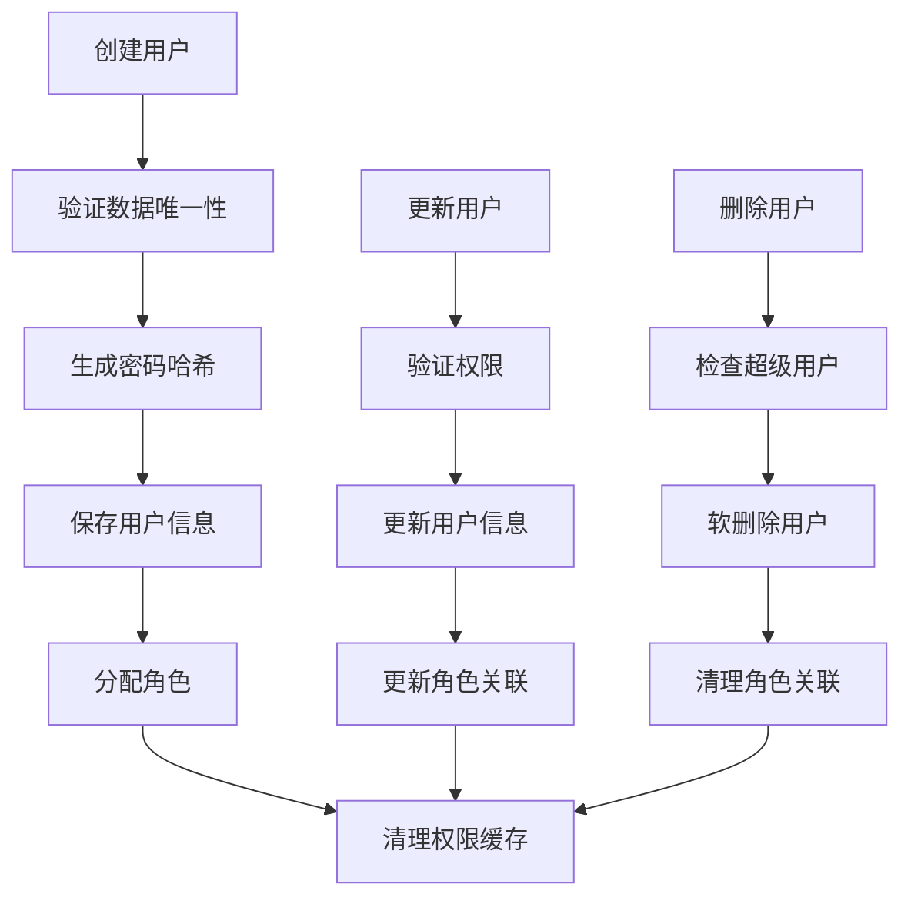
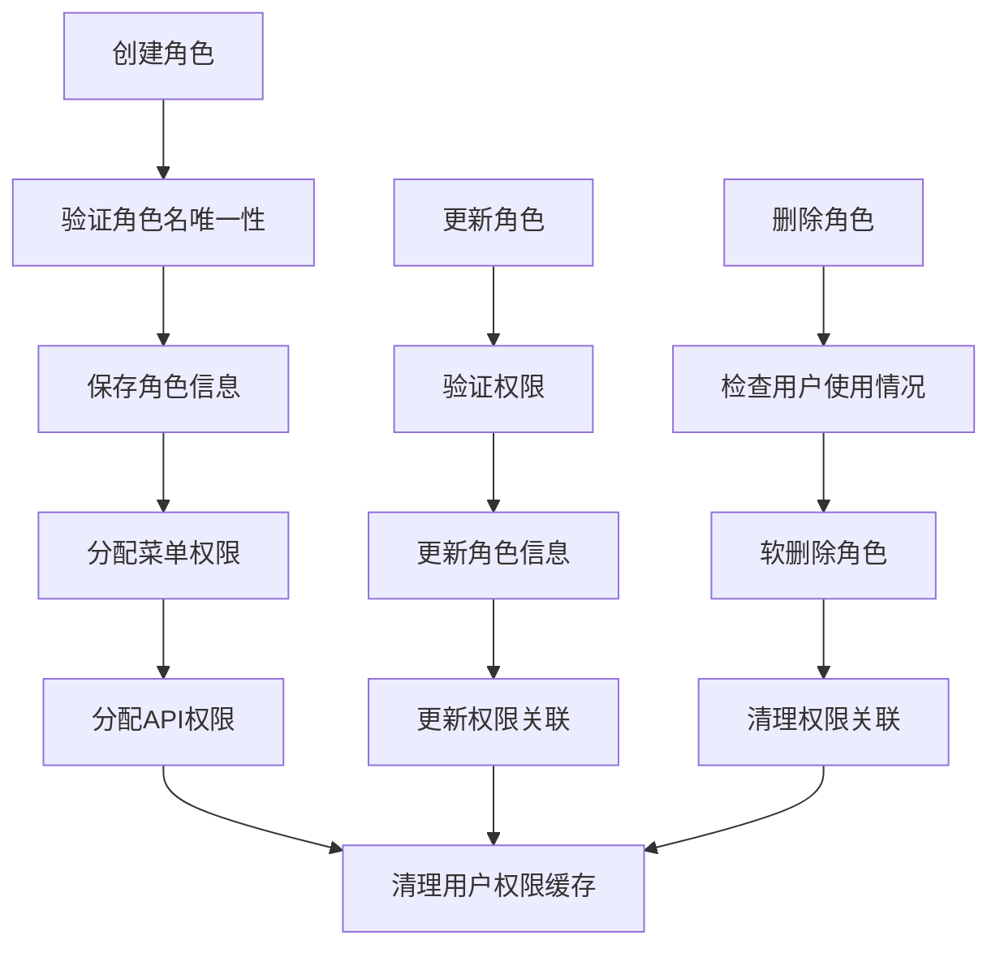
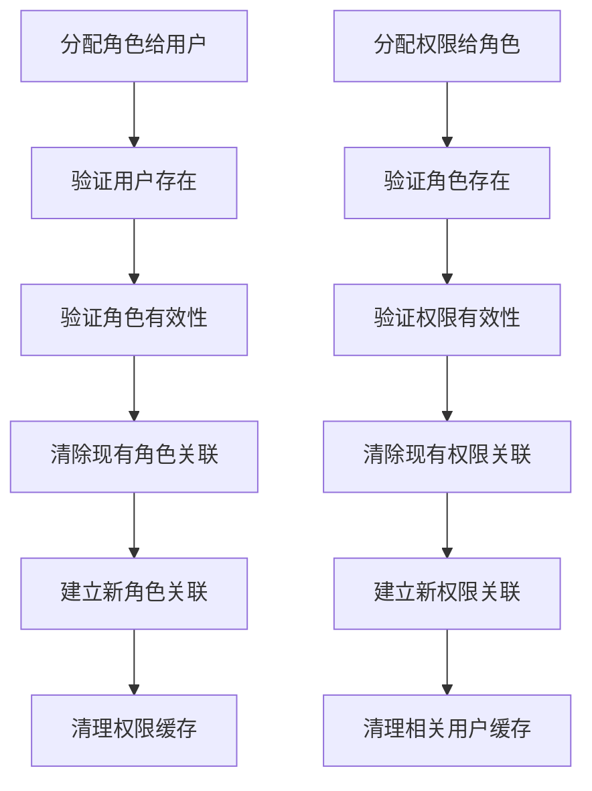

# 任务7完成报告：角色和用户管理API

## 任务概述
实现用户CRUD API、角色CRUD API、用户角色关联管理API，以及批量用户操作API和权限控制等功能。

## 完成的功能

### 1. 角色管理服务 (`app/services/role_management_service.py`)

#### 核心功能
- **角色CRUD操作**：创建、查询、更新、删除角色
- **角色权限分配**：为角色分配菜单权限和API权限
- **角色状态管理**：启用、禁用角色状态
- **角色用户管理**：查看角色下的用户列表
- **批量操作**：批量更新角色状态
- **角色树结构**：支持层级角色管理
- **统计功能**：角色数量、状态分布等统计

#### 主要方法
```python
class RoleManagementService:
    - create_role()                    # 创建角色
    - get_role()                       # 获取角色详情
    - get_roles()                      # 获取角色列表（分页）
    - update_role()                    # 更新角色
    - delete_role()                    # 删除角色（软删除）
    - update_role_status()             # 更新角色状态
    - get_role_menus()                 # 获取角色菜单权限
    - get_role_apis()                  # 获取角色API权限
    - assign_menus_to_role()           # 分配菜单权限
    - assign_apis_to_role()            # 分配API权限
    - get_role_users()                 # 获取角色用户列表
    - batch_update_role_status()       # 批量更新状态
    - get_role_tree()                  # 获取角色树结构
    - get_role_statistics()            # 获取统计信息
```

#### 安全特性
- **数据完整性验证**：角色名、角色键唯一性检查
- **关联检查**：删除前检查用户使用情况
- **权限缓存清理**：权限变更时自动清理相关缓存
- **事务处理**：使用数据库事务确保数据一致性

### 2. 用户管理服务 (`app/services/user_management_service.py`)

#### 核心功能
- **用户CRUD操作**：创建、查询、更新、删除用户
- **用户角色分配**：为用户分配和管理角色
- **用户状态管理**：启用、禁用用户状态
- **密码管理**：重置密码、修改密码
- **批量操作**：批量更新状态、批量重置密码
- **用户搜索**：支持关键词搜索用户
- **登录信息管理**：更新用户登录IP和时间
- **统计功能**：用户数量、类型分布等统计

#### 主要方法
```python
class UserManagementService:
    - create_user()                    # 创建用户
    - get_user()                       # 获取用户详情
    - get_user_by_username()           # 根据用户名获取用户
    - get_user_by_email()              # 根据邮箱获取用户
    - get_users()                      # 获取用户列表（分页、搜索）
    - update_user()                    # 更新用户
    - delete_user()                    # 删除用户（软删除）
    - update_user_status()             # 更新用户状态
    - reset_user_password()            # 重置用户密码
    - change_user_password()           # 修改用户密码
    - get_user_roles()                 # 获取用户角色
    - assign_roles_to_user()           # 分配角色给用户
    - update_user_login_info()         # 更新登录信息
    - batch_update_user_status()       # 批量更新状态
    - batch_reset_user_password()      # 批量重置密码
    - get_user_statistics()            # 获取统计信息
```

#### 安全特性
- **数据唯一性验证**：用户名、邮箱唯一性检查
- **超级用户保护**：防止删除或禁用超级用户
- **密码安全**：密码哈希存储，旧密码验证
- **权限缓存清理**：用户信息变更时自动清理缓存
- **批量操作安全**：批量操作时过滤超级用户

### 3. 角色管理API控制器 (`app/controllers/role_management_controller.py`)

#### REST API接口
- `POST /api/v2/admin/roles/` - 创建角色
- `GET /api/v2/admin/roles/` - 获取角色列表
- `GET /api/v2/admin/roles/{role_id}` - 获取角色详情
- `PUT /api/v2/admin/roles/{role_id}` - 更新角色
- `DELETE /api/v2/admin/roles/{role_id}` - 删除角色
- `PATCH /api/v2/admin/roles/{role_id}/status` - 更新角色状态
- `POST /api/v2/admin/roles/batch-update-status` - 批量更新状态
- `GET /api/v2/admin/roles/{role_id}/menus` - 获取角色菜单权限
- `GET /api/v2/admin/roles/{role_id}/apis` - 获取角色API权限
- `POST /api/v2/admin/roles/{role_id}/assign-menus` - 分配菜单权限
- `POST /api/v2/admin/roles/{role_id}/assign-apis` - 分配API权限
- `GET /api/v2/admin/roles/{role_id}/users` - 获取角色用户列表
- `GET /api/v2/admin/roles/tree` - 获取角色树结构
- `GET /api/v2/admin/roles/statistics` - 获取角色统计信息

#### 权限控制
- **管理员权限**：创建、更新、删除、批量操作需要管理员权限
- **普通用户权限**：查看角色列表和统计信息
- **数据验证**：使用Pydantic模型进行请求数据验证

### 4. 用户管理API控制器 (`app/controllers/user_management_controller.py`)

#### REST API接口
- `POST /api/v2/admin/users/` - 创建用户
- `GET /api/v2/admin/users/` - 获取用户列表
- `GET /api/v2/admin/users/{user_id}` - 获取用户详情
- `PUT /api/v2/admin/users/{user_id}` - 更新用户
- `DELETE /api/v2/admin/users/{user_id}` - 删除用户
- `PATCH /api/v2/admin/users/{user_id}/status` - 更新用户状态
- `POST /api/v2/admin/users/{user_id}/reset-password` - 重置用户密码
- `POST /api/v2/admin/users/{user_id}/change-password` - 修改用户密码
- `POST /api/v2/admin/users/batch-update-status` - 批量更新状态
- `POST /api/v2/admin/users/batch-reset-password` - 批量重置密码
- `GET /api/v2/admin/users/{user_id}/roles` - 获取用户角色
- `POST /api/v2/admin/users/{user_id}/assign-roles` - 分配角色给用户
- `GET /api/v2/admin/users/statistics` - 获取用户统计信息
- `GET /api/v2/admin/users/profile` - 获取当前用户信息

#### 权限控制
- **管理员权限**：用户管理操作需要管理员权限
- **用户自管理**：用户可以修改自己的密码和查看自己的信息
- **超级用户保护**：特殊保护超级用户不被误操作

### 5. 数据模型支持

#### 请求模型
```python
# 角色相关
class RoleCreateRequest(BaseModel):
    role_name: str
    role_key: Optional[str]
    role_sort: Optional[int]
    data_scope: Optional[str]
    menu_ids: Optional[List[int]]
    api_ids: Optional[List[int]]

# 用户相关
class UserCreateRequest(BaseModel):
    username: str
    nick_name: Optional[str]
    email: Optional[EmailStr]
    phone_number: Optional[str]
    password: Optional[str]
    role_ids: Optional[List[int]]
```

#### 响应模型
- 统一的API响应格式
- 详细的错误信息
- 分页数据结构
- 统计信息格式

### 6. 测试验证 (`test_user_role_management.py`)

#### 测试覆盖
- ✅ 用户管理功能测试
- ✅ 角色管理功能测试
- ✅ 权限分配功能测试
- ✅ 批量操作功能测试
- ✅ 错误处理测试
- ✅ 统计功能测试

#### 测试结果
```
🚀 用户和角色管理系统综合测试
✅ 用户CRUD操作正常
✅ 角色CRUD操作正常
✅ 权限分配功能正常
✅ 批量操作功能正常
✅ 错误处理机制正常
✅ 统计功能正常
```

## 技术特性

### 1. 数据完整性
- 用户名、邮箱、角色名唯一性验证
- 外键关联完整性检查
- 软删除机制保护数据
- 事务处理确保一致性

### 2. 安全控制
- 超级用户特殊保护机制
- 密码安全存储和验证
- 权限级别控制
- 操作日志记录

### 3. 性能优化
- 数据库查询优化
- 权限缓存管理
- 批量操作支持
- 分页查询减少内存占用

### 4. 用户体验
- 关键词搜索功能
- 多条件过滤
- 树形结构支持
- 详细的统计信息

### 5. 扩展性
- 模块化设计
- 服务层分离
- 统一的错误处理
- 灵活的权限配置

## 业务流程

### 1. 用户管理流程


### 2. 角色管理流程


### 3. 权限分配流程


## 集成说明

### 1. 数据库集成
- 使用现有的用户、角色、菜单、API端点模型
- 支持多对多关联关系
- 兼容现有数据结构

### 2. 权限系统集成
- 与权限缓存系统集成
- 支持权限验证中间件
- 自动清理相关缓存

### 3. 认证系统集成
- 与JWT认证系统集成
- 支持用户登录信息更新
- 密码安全管理

## 使用示例

### 1. 创建用户
```python
from app.services.user_management_service import create_user

user_data = {
    "username": "new_user",
    "nick_name": "新用户",
    "email": "new_user@example.com",
    "password": "secure_password",
    "role_ids": [1, 2]
}

user = await create_user(user_data)
```

### 2. 创建角色
```python
from app.services.role_management_service import create_role

role_data = {
    "role_name": "新角色",
    "role_key": "new_role",
    "menu_ids": [1, 2, 3],
    "api_ids": [1, 2, 3]
}

role = await create_role(role_data)
```

### 3. 分配权限
```python
from app.services.role_management_service import assign_apis_to_role

# 为角色分配API权限
success = await assign_apis_to_role(role_id=1, api_ids=[1, 2, 3])
```

## 部署说明

### 1. 依赖要求
- FastAPI：REST API框架
- Tortoise ORM：数据库操作
- Pydantic：数据验证
- bcrypt：密码哈希

### 2. 配置要求
- 数据库连接配置
- 权限级别配置
- 默认密码配置

### 3. 初始化步骤
1. 确保数据库表结构已创建
2. 创建初始超级用户
3. 配置基础角色和权限
4. 测试API接口功能

## 监控和维护

### 1. 性能监控
- 监控API响应时间
- 监控数据库查询性能
- 监控缓存命中率

### 2. 数据维护
- 定期清理软删除数据
- 定期备份用户和角色数据
- 监控数据完整性

### 3. 安全监控
- 监控用户登录异常
- 监控权限变更操作
- 监控批量操作记录

## 总结

任务7"角色和用户管理API"已成功完成，实现了完整的用户和角色管理系统，包括：

1. ✅ 用户CRUD API，支持用户状态管理
2. ✅ 角色CRUD API，支持角色权限分配
3. ✅ 用户角色关联管理API
4. ✅ 批量用户操作API和权限控制
5. ✅ 完整的数据验证和错误处理
6. ✅ 安全的权限控制机制
7. ✅ 高性能的缓存管理
8. ✅ 全面的测试验证

该系统为用户权限管理提供了强大的基础功能，支持灵活的用户和角色管理，为后续的菜单权限管理和前端权限控制奠定了坚实的基础。