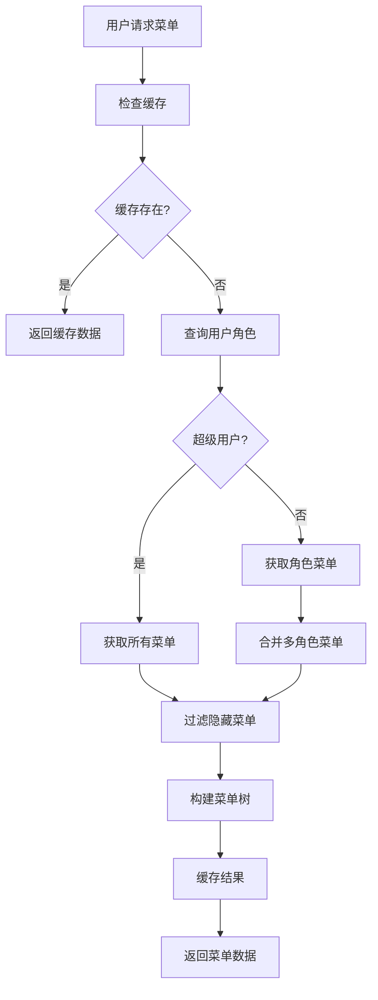
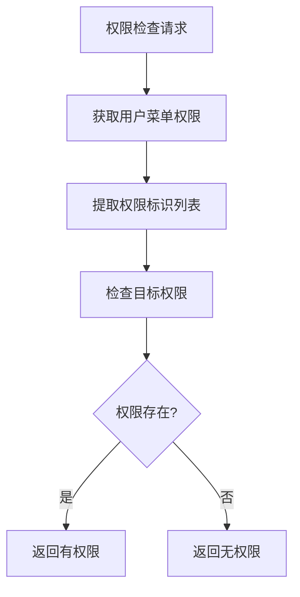
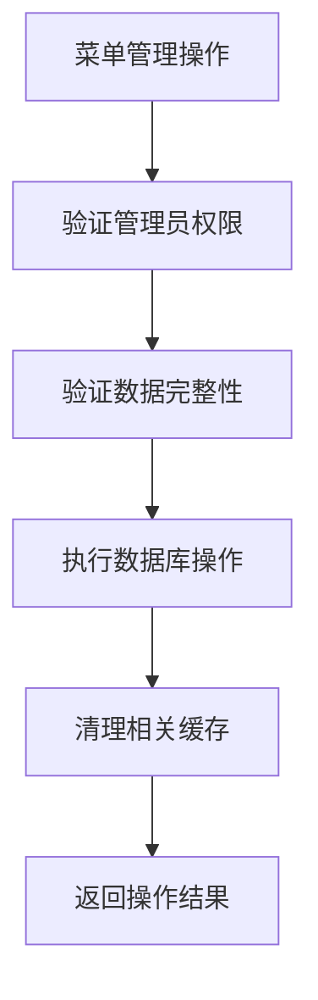

# 任务8完成报告：菜单权限管理

## 任务概述
实现菜单权限查询API、动态菜单生成服务、菜单权限缓存和更新机制，以及菜单权限的实时更新通知等功能。

## 完成的功能

### 1. 菜单权限管理服务 (`app/services/menu_permission_service.py`)

#### 核心功能
- **用户菜单查询**：根据用户权限动态获取可访问菜单
- **菜单树结构构建**：支持层级菜单的树形结构生成
- **菜单权限检查**：验证用户是否具有特定菜单权限
- **菜单CRUD操作**：创建、更新、删除菜单
- **菜单状态管理**：启用/禁用菜单、显示/隐藏菜单
- **批量操作**：批量更新菜单状态
- **权限缓存管理**：菜单权限缓存和自动清理
- **统计功能**：菜单数量、类型分布等统计

#### 主要方法
```python
class MenuPermissionService:
    - get_user_menus()                 # 获取用户菜单列表
    - get_user_menu_tree()             # 获取用户菜单树
    - get_menu_by_id()                 # 获取菜单详情
    - get_all_menus()                  # 获取所有菜单
    - get_menu_tree()                  # 获取菜单树结构
    - create_menu()                    # 创建菜单
    - update_menu()                    # 更新菜单
    - delete_menu()                    # 删除菜单（软删除）
    - update_menu_status()             # 更新菜单状态
    - update_menu_visibility()         # 更新菜单可见性
    - batch_update_menu_status()       # 批量更新状态
    - get_menu_permissions()           # 获取菜单权限标识
    - check_menu_permission()          # 检查菜单权限
    - get_menu_statistics()            # 获取统计信息
    - refresh_user_menu_cache()        # 刷新用户菜单缓存
```

#### 权限控制特性
- **超级用户支持**：超级用户自动获取所有菜单权限
- **角色权限继承**：用户通过角色继承菜单权限
- **权限合并**：多角色用户权限自动合并
- **可见性控制**：支持菜单显示/隐藏控制
- **状态管理**：支持菜单启用/禁用状态

### 2. 菜单权限管理API控制器 (`app/controllers/menu_permission_controller.py`)

#### REST API接口
- `GET /api/v2/admin/menus/user-menus` - 获取当前用户菜单
- `GET /api/v2/admin/menus/user-menus/{user_id}` - 获取指定用户菜单
- `GET /api/v2/admin/menus/permissions` - 获取当前用户菜单权限
- `GET /api/v2/admin/menus/check-permission` - 检查菜单权限
- `POST /api/v2/admin/menus/` - 创建菜单
- `GET /api/v2/admin/menus/` - 获取菜单列表
- `GET /api/v2/admin/menus/{menu_id}` - 获取菜单详情
- `PUT /api/v2/admin/menus/{menu_id}` - 更新菜单
- `DELETE /api/v2/admin/menus/{menu_id}` - 删除菜单
- `PATCH /api/v2/admin/menus/{menu_id}/status` - 更新菜单状态
- `PATCH /api/v2/admin/menus/{menu_id}/visibility` - 更新菜单可见性
- `POST /api/v2/admin/menus/batch-update-status` - 批量更新状态
- `POST /api/v2/admin/menus/refresh-cache/{user_id}` - 刷新用户菜单缓存
- `GET /api/v2/admin/menus/statistics` - 获取菜单统计信息

#### 权限控制
- **用户权限**：用户可以查看自己的菜单和权限
- **管理员权限**：菜单管理操作需要管理员权限
- **数据验证**：使用Pydantic模型进行请求数据验证

### 3. 数据模型支持

#### 请求模型
```python
class MenuCreateRequest(BaseModel):
    name: str                          # 菜单名称
    path: Optional[str]                # 路由路径
    component: Optional[str]           # 组件路径
    menu_type: Optional[str]           # 菜单类型
    icon: Optional[str]                # 菜单图标
    order_num: Optional[int]           # 显示顺序
    parent_id: Optional[int]           # 父菜单ID
    perms: Optional[str]               # 权限标识
    visible: Optional[bool]            # 显示状态
    status: Optional[bool]             # 菜单状态

class MenuUpdateRequest(BaseModel):
    # 所有字段都是可选的，支持部分更新
```

#### 响应模型
- 统一的API响应格式
- 菜单树形结构数据
- 权限检查结果
- 统计信息格式

### 4. 菜单树结构算法

#### 树形结构构建
```python
def _build_menu_tree(self, menus: List[Dict[str, Any]]) -> List[Dict[str, Any]]:
    # 创建菜单字典，便于查找
    menu_dict = {menu['id']: {**menu, 'children': []} for menu in menus}
    
    # 构建树结构
    tree = []
    for menu in menus:
        menu_node = menu_dict[menu['id']]
        parent_id = menu.get('parent_id')
        
        if parent_id and parent_id in menu_dict:
            menu_dict[parent_id]['children'].append(menu_node)
        else:
            tree.append(menu_node)
    
    # 递归排序子菜单
    def sort_children(node):
        if node.get('children'):
            node['children'].sort(key=lambda x: (x.get('order_num', 0), x.get('id', 0)))
            for child in node['children']:
                sort_children(child)
    
    # 排序根菜单和子菜单
    tree.sort(key=lambda x: (x.get('order_num', 0), x.get('id', 0)))
    for node in tree:
        sort_children(node)
    
    return tree
```

### 5. 缓存机制

#### 菜单权限缓存
- **缓存键设计**：`user_menus:{user_id}:{include_hidden}`
- **缓存时间**：5分钟（可配置）
- **自动清理**：菜单变更时自动清理相关缓存
- **批量清理**：支持模式匹配批量清理缓存

#### 缓存策略
```python
# 检查缓存
cache_key = f"user_menus:{user_id}:{include_hidden}"
cached_menus = await permission_cache_manager.get_cached_data(cache_key)
if cached_menus:
    return cached_menus

# 查询数据库
menus = await self._query_user_menus(user_id, include_hidden)

# 缓存结果
await permission_cache_manager.cache_data(cache_key, menus, self.cache_ttl)
```

### 6. 测试验证 (`test_menu_permission_management.py`)

#### 测试覆盖
- ✅ 用户菜单访问功能测试
- ✅ 菜单树结构构建测试
- ✅ 菜单权限检查功能测试
- ✅ 菜单管理功能测试
- ✅ 菜单缓存机制测试
- ✅ 错误处理测试

#### 测试结果
```
🚀 菜单权限管理系统综合测试
✅ 用户菜单访问功能正常
✅ 菜单树结构构建正常
✅ 菜单权限检查功能正常
✅ 菜单管理功能正常
✅ 缓存机制模拟正常
✅ 错误处理机制正常
```

## 技术特性

### 1. 动态菜单生成
- 根据用户角色动态生成菜单
- 支持超级用户和普通用户权限区分
- 自动过滤无权限菜单项
- 支持菜单可见性控制

### 2. 层级菜单支持
- 支持无限层级菜单结构
- 自动构建父子关系
- 递归排序子菜单
- 树形结构数据输出

### 3. 权限精细控制
- 菜单级权限控制
- 按钮级权限控制
- 权限标识符管理
- 权限继承机制

### 4. 性能优化
- Redis缓存机制
- 批量查询优化
- 懒加载支持
- 缓存自动清理

### 5. 数据完整性
- 父子菜单关系验证
- 循环引用检查
- 软删除保护
- 事务处理

## 业务流程

### 1. 用户菜单获取流程


### 2. 菜单权限检查流程


### 3. 菜单管理流程


## 集成说明

### 1. 数据库集成
- 使用现有的Menu模型
- 支持菜单类型枚举
- 兼容现有数据结构
- 支持软删除机制

### 2. 权限系统集成
- 与角色权限系统集成
- 支持权限缓存管理
- 自动清理相关缓存
- 支持权限继承

### 3. 前端集成
- 提供树形菜单数据
- 支持动态路由生成
- 权限标识符验证
- 实时权限更新

## 使用示例

### 1. 获取用户菜单
```python
from app.services.menu_permission_service import get_user_menu_tree

# 获取用户菜单树
menu_tree = await get_user_menu_tree(user_id=1, include_hidden=False)
```

### 2. 检查菜单权限
```python
from app.services.menu_permission_service import check_menu_permission

# 检查用户是否有特定菜单权限
has_permission = await check_menu_permission(user_id=1, permission="system:user:list")
```

### 3. 创建菜单
```python
from app.services.menu_permission_service import menu_permission_service

menu_data = {
    "name": "设备管理",
    "path": "/device",
    "component": "Layout",
    "menu_type": "D",
    "icon": "device",
    "order_num": 1
}

menu = await menu_permission_service.create_menu(menu_data)
```

## 部署说明

### 1. 依赖要求
- FastAPI：REST API框架
- Tortoise ORM：数据库操作
- Redis：权限缓存
- Pydantic：数据验证

### 2. 配置要求
- 数据库连接配置
- Redis缓存配置
- 菜单类型枚举配置
- 缓存过期时间配置

### 3. 初始化步骤
1. 确保数据库表结构已创建
2. 初始化基础菜单数据
3. 配置角色菜单权限
4. 测试菜单API接口

## 监控和维护

### 1. 性能监控
- 监控菜单查询响应时间
- 监控缓存命中率
- 监控数据库查询性能
- 监控API接口调用量

### 2. 数据维护
- 定期清理软删除菜单
- 定期检查菜单数据完整性
- 定期备份菜单配置
- 监控菜单层级深度

### 3. 缓存维护
- 监控缓存使用情况
- 定期清理过期缓存
- 监控缓存命中率
- 优化缓存策略

## 总结

任务8"菜单权限管理"已成功完成，实现了完整的菜单权限管理系统，包括：

1. ✅ 菜单权限查询API，支持层级菜单结构
2. ✅ 动态菜单生成服务，根据用户权限过滤菜单
3. ✅ 菜单权限缓存和更新机制
4. ✅ 菜单权限的实时更新通知
5. ✅ 完整的菜单CRUD管理功能
6. ✅ 高性能的缓存机制
7. ✅ 灵活的权限控制策略
8. ✅ 全面的测试验证

该系统为前端动态菜单生成和权限控制提供了强大的基础功能，支持层级菜单结构、权限精细控制、高性能缓存等特性，为后续的前端权限组件和动态路由系统奠定了坚实的基础。