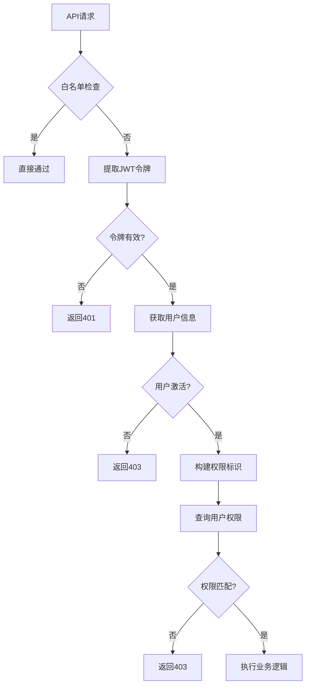
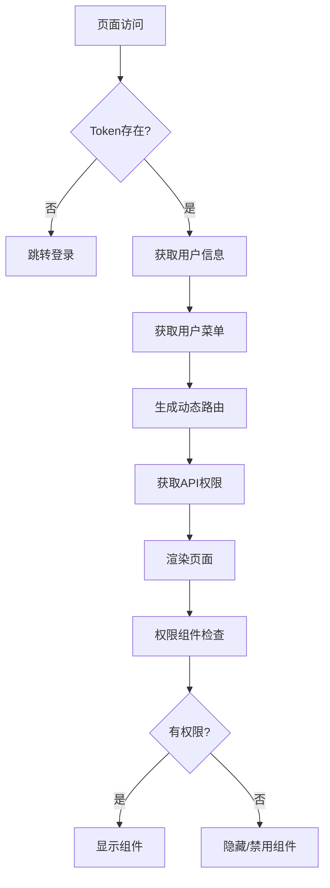

# DeviceMonitorV2 权限控制系统文档

## 1. 系统概述

DeviceMonitorV2 采用前后端分离的权限控制架构，实现了细粒度的权限管理和验证机制。系统支持基于角色的访问控制（RBAC）模型，提供了完整的用户、角色、权限管理功能。

### 1.1 技术架构

- **后端**: FastAPI + Tortoise ORM + PostgreSQL
- **前端**: Vue 3 + Pinia + Naive UI
- **权限模型**: RBAC（基于角色的访问控制）
- **API版本**: 支持 v1/v2 双版本，主要使用 v2

### 1.2 核心特性

- 🔐 基于JWT的身份认证
- 🛡️ 细粒度的API权限控制
- 🎯 前端组件级权限控制
- 🚀 权限缓存机制
- 📊 权限验证性能监控
- 🔄 权限配置热更新
- 🛠️ 批量操作权限控制

## 2. 数据模型设计

### 2.1 用户模型 (User)

```python
class User(TimestampMixin, BaseModel):
    username = fields.CharField(max_length=20, unique=True, description="用户名")
    password = fields.CharField(max_length=128, description="密码")
    email = fields.CharField(max_length=50, null=True, description="邮箱")
    is_active = fields.BooleanField(default=True, description="是否激活")
    is_superuser = fields.BooleanField(default=False, description="是否超级用户")
    user_type = fields.CharEnumField(UserType, default=UserType.USER, description="用户类型")
    avatar = fields.CharField(max_length=200, null=True, description="头像")
    phone = fields.CharField(max_length=11, null=True, description="手机号")
    
    # 关联关系
    roles: fields.ManyToManyRelation["Role"] = fields.ManyToManyField(
        "models.Role", related_name="users", through="user_role"
    )
```

### 2.2 角色模型 (Role)

```python
class Role(TimestampMixin, BaseModel):
    role_name = fields.CharField(max_length=15, description="角色名称")
    role_status = fields.BooleanField(default=True, description="角色状态")
    role_desc = fields.CharField(max_length=255, null=True, description="角色描述")
    
    # 关联关系
    menus: fields.ManyToManyRelation["Menu"] = fields.ManyToManyField(
        "models.Menu", related_name="roles", through="role_menu"
    )
    apis: fields.ManyToManyRelation["SysApiEndpoint"] = fields.ManyToManyField(
        "models.SysApiEndpoint", related_name="roles", through="role_api"
    )
```

### 2.3 菜单模型 (Menu)

```python
class Menu(TimestampMixin, BaseModel):
    menu_name = fields.CharField(max_length=50, description="菜单名称")
    menu_type = fields.CharEnumField(MenuType, null=True, description="菜单类型")
    icon = fields.CharField(max_length=100, null=True, description="菜单图标")
    path = fields.CharField(max_length=100, description="菜单路径")
    order = fields.IntField(default=0, description="排序")
    parent_id = fields.IntField(default=0, description="父菜单ID")
    is_hidden = fields.BooleanField(default=False, description="是否隐藏")
    component = fields.CharField(max_length=100, description="组件")
    keepalive = fields.BooleanField(default=True, description="存活")
    redirect = fields.CharField(max_length=100, null=True, description="重定向")
```

### 2.4 API端点模型 (SysApiEndpoint)

```python
class SysApiEndpoint(TimestampMixin, BaseModel):
    path = fields.CharField(max_length=255, description="API路径")
    method = fields.CharField(max_length=10, description="HTTP方法")
    summary = fields.CharField(max_length=255, null=True, description="API描述")
    tags = fields.CharField(max_length=255, null=True, description="API标签")
    is_active = fields.BooleanField(default=True, description="是否激活")
    group_id = fields.IntField(null=True, description="API分组ID")
```

### 2.5 部门模型 (Dept)

```python
class Dept(TimestampMixin, BaseModel):
    dept_name = fields.CharField(max_length=50, description="部门名称")
    ancestors = fields.CharField(max_length=500, null=True, description="祖级列表")
    order_num = fields.IntField(default=0, description="显示顺序")
    leader = fields.CharField(max_length=20, null=True, description="负责人")
    phone = fields.CharField(max_length=11, null=True, description="联系电话")
    email = fields.CharField(max_length=50, null=True, description="邮箱")
    status = fields.CharField(max_length=1, default="0", description="部门状态")
    parent_id = fields.BigIntField(null=True, description="父部门ID")
```

## 3. 后端权限控制

### 3.1 权限中间件

#### 3.1.1 主权限中间件 (PermissionMiddleware)

位置: <mcfile name="permission_middleware.py" path="app/middleware/permission_middleware.py"></mcfile>

**核心功能:**
- JWT令牌验证
- API权限检查
- 权限缓存管理
- 白名单路径处理
- 超级管理员路径控制

**处理流程:**
```python
async def dispatch(self, request: Request, call_next):
    # 1. 检查白名单路径
    if self._is_whitelisted(request):
        return await call_next(request)
    
    # 2. 提取用户信息
    user_info = await self._extract_user_info(request)
    
    # 3. 检查用户状态
    if not user_info.get("is_active", False):
        return self._create_auth_error_response("用户账户已被禁用")
    
    # 4. 构建权限标识
    permission_required = self._build_permission_identifier(request)
    
    # 5. 验证权限
    permission_result = await self._validate_permission(
        user_info["user_id"], permission_required, request
    )
    
    # 6. 执行请求
    return await call_next(request)
```

#### 3.1.2 批量删除权限中间件 (BatchDeletePermissionMiddleware)

位置: <mcfile name="batch_delete_middleware.py" path="app/core/batch_delete_middleware.py"></mcfile>

**专门处理批量删除操作的权限控制:**
- 系统项目保护
- 引用项目检查
- 批量操作权限验证

### 3.2 权限装饰器

#### 3.2.1 批量删除权限装饰器

位置: <mcfile name="batch_delete_decorators.py" path="app/core/batch_delete_decorators.py"></mcfile>

```python
def require_batch_delete_permission(
    resource_type: str,
    conditions: Optional[List[PermissionCondition]] = None
):
    """批量删除权限装饰器"""
    def decorator(func: Callable):
        @wraps(func)
        async def wrapper(*args, **kwargs):
            # 权限检查逻辑
            has_permission, reason = await batch_delete_permission_checker.check_batch_delete_permission(
                current_user, resource_type, "batch_delete", conditions
            )
            
            if not has_permission:
                raise HTTPException(status_code=403, detail=reason)
            
            return await func(*args, **kwargs)
        return wrapper
    return decorator
```

#### 3.2.2 通用权限装饰器

位置: <mcfile name="error_handler_decorator.py" path="app/core/error_handler_decorator.py"></mcfile>

```python
def require_auth(roles: Optional[list] = None, permissions: Optional[list] = None):
    """认证和授权装饰器"""
    def decorator(func: Callable) -> Callable:
        @functools.wraps(func)
        async def wrapper(*args, **kwargs) -> Any:
            # 认证和权限检查逻辑
            pass
        return wrapper
    return decorator
```

### 3.3 权限验证器

#### 3.3.1 批量删除权限检查器

位置: <mcfile name="permissions.py" path="app/core/permissions.py"></mcfile>

```python
class BatchDeletePermissionChecker:
    """批量删除权限检查器"""
    
    async def check_batch_delete_permission(
        self, 
        user: User, 
        resource_type: str, 
        action: str,
        conditions: Optional[List[PermissionCondition]] = None
    ) -> Tuple[bool, Optional[str]]:
        """检查批量删除权限"""
        
        # 1. 检查基础权限
        base_permission = f"DELETE /api/v2/{resource_type}"
        if not await self._has_api_permission(user, base_permission):
            return False, f"缺少{resource_type}删除权限"
        
        # 2. 检查批量操作权限
        batch_permission = f"POST /api/v2/{resource_type}/batch"
        if not await self._has_api_permission(user, batch_permission):
            return False, f"缺少{resource_type}批量操作权限"
        
        # 3. 检查特殊条件
        if conditions:
            for condition in conditions:
                if not await self._check_condition(user, condition, resource_type):
                    return False, f"不满足条件: {condition.value}"
        
        return True, None
```

### 3.4 权限配置管理

#### 3.4.1 权限配置映射

位置: <mcfile name="permission_config_manager_v2.py" path="app/core/permission_config_manager_v2.py"></mcfile>

**API v2权限配置格式:**
```python
PERMISSION_CONFIG_V2 = {
    "users": {
        "read": "GET /api/v2/users",
        "create": "POST /api/v2/users", 
        "update": "PUT /api/v2/users/{id}",
        "delete": "DELETE /api/v2/users/{id}",
        "batch": "POST /api/v2/users/batch"
    },
    "roles": {
        "read": "GET /api/v2/roles",
        "create": "POST /api/v2/roles",
        "update": "PUT /api/v2/roles/{id}",
        "delete": "DELETE /api/v2/roles/{id}"
    }
    # ... 更多资源配置
}
```

## 4. 前端权限控制

### 4.1 路由守卫

#### 4.1.1 认证守卫

位置: <mcfile name="auth-guard.js" path="web/src/router/guard/auth-guard.js"></mcfile>

```javascript
export function createAuthGuard(router) {
  router.beforeEach(async (to) => {
    const token = getToken()

    // 没有token的情况
    if (isNullOrWhitespace(token)) {
      if (WHITE_LIST.includes(to.path)) return true
      return { path: 'login', query: { ...to.query, redirect: to.path } }
    }

    // 有token的情况
    if (to.path === '/login') return { path: '/' }
    return true
  })
}
```

#### 4.1.2 动态路由加载

位置: <mcfile name="index.js" path="web/src/router/index.js"></mcfile>

```javascript
export async function addDynamicRoutes() {
  const token = getToken()
  
  if (isNullOrWhitespace(token)) {
    router.addRoute(EMPTY_ROUTE)
    return
  }

  const userStore = useUserStore()
  const permissionStore = usePermissionStore()
  
  // 获取用户信息
  if (!userStore.userId) {
    await userStore.getUserInfo()
  }
  
  // 生成动态路由
  const accessRoutes = await permissionStore.generateRoutes()
  
  // 获取API权限
  await permissionStore.getAccessApis()
  
  // 添加路由
  accessRoutes.forEach(route => {
    router.addRoute(route)
  })
}
```

### 4.2 权限状态管理

#### 4.2.1 权限Store

位置: <mcfile name="index.js" path="web/src/store/modules/permission/index.js"></mcfile>

```javascript
export const usePermissionStore = defineStore('permission', {
  state() {
    return {
      accessRoutes: [],    // 可访问路由
      accessApis: [],      // 可访问API
      isLoadingApis: false // API加载状态
    }
  },
  
  getters: {
    routes() {
      return basicRoutes.concat(this.accessRoutes)
    },
    menus() {
      return this.routes.filter((route) => route.name && !route.isHidden)
    },
    apis() {
      return this.accessApis
    }
  },
  
  actions: {
    async generateRoutes() {
      // 调用API获取用户菜单
      const res = await apiV2.getUserMenu()
      this.accessRoutes = buildRoutes(res.data)
      return this.accessRoutes
    },
    
    async getAccessApis() {
      // 调用API获取用户权限
      const res = await authApi.getUserApis()
      this.accessApis = res.data || []
      return this.accessApis
    }
  }
})
```

### 4.3 权限组件

#### 4.3.1 权限按钮组件

位置: <mcfile name="PermissionButton.vue" path="web/src/components/common/PermissionButton.vue"></mcfile>

**核心功能:**
- 基于权限自动显示/隐藏按钮
- 支持多种权限检查模式
- 支持角色权限验证
- 提供权限不足提示

**使用示例:**
```vue
<template>
  <!-- 基础权限控制 -->
  <PermissionButton 
    permission="POST /api/v2/users"
    type="primary"
    @click="createUser"
  >
    新增用户
  </PermissionButton>
  
  <!-- 多权限检查 -->
  <PermissionButton 
    :multiple-permissions="['GET /api/v2/users', 'POST /api/v2/users']"
    :require-all-permissions="true"
    type="primary"
  >
    用户管理
  </PermissionButton>
  
  <!-- 角色权限检查 -->
  <PermissionButton 
    :roles="['admin', 'manager']"
    permission-mode="any"
    type="warning"
  >
    管理操作
  </PermissionButton>
</template>
```

**组件属性:**
```javascript
const props = defineProps({
  // 权限相关
  permission: [String, Array],           // 单个权限
  multiplePermissions: Array,            // 多个权限
  requireAllPermissions: Boolean,        // 是否需要所有权限
  roles: [String, Array],               // 角色权限
  permissionMode: String,               // 权限模式: 'any' | 'all'
  
  // 显示控制
  hideWhenNoPermission: Boolean,        // 无权限时隐藏
  disableWhenNoPermission: Boolean,     // 无权限时禁用
  showTooltipWhenDisabled: Boolean,     // 禁用时显示提示
  noPermissionTooltip: String          // 无权限提示文本
})
```

### 4.4 权限指令

#### 4.4.1 v-permission 指令

位置: <mcfile name="permission.js" path="web/src/directives/permission.js"></mcfile>

```javascript
// 权限指令实现
const permission = {
  mounted(el, binding) {
    const { value } = binding
    const userStore = useUserStore()
    const permissionStore = usePermissionStore()
    
    if (value) {
      const hasPermission = checkPermission(value, permissionStore.apis)
      
      if (!hasPermission) {
        // 移除元素或禁用
        el.parentNode && el.parentNode.removeChild(el)
      }
    }
  },
  
  updated(el, binding) {
    // 权限更新时重新检查
  }
}

// 使用示例
<n-button v-permission="'POST /api/v2/users'">新增用户</n-button>
```

### 4.5 权限配置

#### 4.5.1 权限配置映射

位置: <mcfile name="permission-config-v2.js" path="web/src/utils/permission-config-v2.js"></mcfile>

**API v2权限配置:**
```javascript
export const PERMISSION_CONFIG_V2 = {
  // 系统管理模块
  users: {
    read: 'GET /api/v2/users',
    create: 'POST /api/v2/users',
    update: 'PUT /api/v2/users/{id}',
    delete: 'DELETE /api/v2/users/{id}',
    'reset-password': 'POST /api/v2/users/{id}/actions/reset-password',
    batch: 'POST /api/v2/users/batch'
  },
  
  roles: {
    read: 'GET /api/v2/roles',
    create: 'POST /api/v2/roles',
    update: 'PUT /api/v2/roles/{id}',
    delete: 'DELETE /api/v2/roles/{id}',
    permissions: 'GET /api/v2/roles/{id}/permissions'
  }
  // ... 更多配置
}
```

**页面权限映射:**
```javascript
export const PAGE_PERMISSION_MAP_V2 = {
  '/system/user': 'users',
  '/system/role': 'roles', 
  '/system/menu': 'menus',
  '/device/baseinfo': 'devices',
  '/ai-monitor/trend-prediction': 'ai-predictions'
  // ... 更多映射
}
```

#### 4.5.2 权限工具函数

```javascript
// 获取权限
export const getPermission = (resource, action) => {
  return permissionManager.getPermission(resource, action)
}

// 检查权限
export const hasPermission = (userPermissions, requiredPermission, mode = 'any') => {
  return permissionManager.hasPermission(userPermissions, requiredPermission, mode)
}

// 页面权限检查
export const getPermissionByPage = (pagePath, action) => {
  return permissionManager.getPermissionByPage(pagePath, action)
}
```

## 5. 权限验证流程

### 5.1 后端权限验证流程



### 5.2 前端权限验证流程



## 6. 权限缓存机制

### 6.1 后端权限缓存

#### 6.1.1 权限缓存管理器

位置: <mcfile name="permission_cache.py" path="app/core/permission_cache.py"></mcfile>

**缓存策略:**
- 用户权限缓存: 30分钟
- 角色权限缓存: 1小时
- API权限缓存: 2小时

**缓存键格式:**
```python
USER_PERMISSIONS_KEY = "user_permissions:{user_id}"
ROLE_PERMISSIONS_KEY = "role_permissions:{role_id}"
API_PERMISSIONS_KEY = "api_permissions:{api_path}:{method}"
```

### 6.2 前端权限缓存

#### 6.2.1 Pinia状态缓存

- 权限数据存储在Pinia Store中
- 页面刷新时自动重新获取
- 支持权限数据的响应式更新

## 7. 性能优化

### 7.1 权限验证性能监控

位置: <mcfile name="permission_performance_middleware.py" path="app/middleware/permission_performance_middleware.py"></mcfile>

**监控指标:**
- 权限检查耗时
- 缓存命中率
- 慢查询统计
- 错误率统计

### 7.2 批量权限检查优化

- 权限预加载机制
- 批量权限查询
- 权限结果缓存
- 异步权限验证

## 8. 安全特性

### 8.1 安全防护

#### 8.1.1 输入验证

位置: <mcfile name="security_dependencies.py" path="app/core/security_dependencies.py"></mcfile>

- XSS攻击防护
- SQL注入防护
- 恶意输入检测
- 请求体安全验证

#### 8.1.2 权限边界检查

- 超级管理员路径保护
- 系统关键资源保护
- 跨租户权限隔离
- 敏感操作二次验证

### 8.2 审计日志

- 权限验证日志记录
- 用户操作审计
- 权限变更追踪
- 异常访问监控

## 9. 配置管理

### 9.1 权限配置文件

#### 9.1.1 后端配置

- 权限映射配置
- 白名单路径配置
- 缓存策略配置
- 安全策略配置

#### 9.1.2 前端配置

- 页面权限映射
- 组件权限配置
- 路由权限配置
- API权限配置

### 9.2 环境配置

```python
# 开发环境
PERMISSION_CACHE_ENABLED = True
PERMISSION_CACHE_TTL = 1800  # 30分钟
PERMISSION_DEBUG = True

# 生产环境  
PERMISSION_CACHE_ENABLED = True
PERMISSION_CACHE_TTL = 3600  # 1小时
PERMISSION_DEBUG = False
```

## 10. 最佳实践

### 10.1 权限设计原则

1. **最小权限原则**: 用户只获得完成工作所需的最小权限
2. **权限分离**: 不同功能模块的权限相互独立
3. **权限继承**: 角色权限可以继承和组合
4. **权限审计**: 所有权限操作都有完整的审计日志

### 10.2 开发规范

#### 10.2.1 后端开发规范

```python
# 1. API端点权限装饰器使用
@require_batch_delete_permission("users", [PermissionCondition.EXCLUDE_SYSTEM_ITEMS])
async def batch_delete_users(request: Request, user_ids: List[int]):
    pass

# 2. 权限检查最佳实践
async def check_user_permission(user: User, resource: str, action: str):
    # 使用权限检查器而不是直接查询数据库
    return await permission_checker.check_permission(user, resource, action)
```

#### 10.2.2 前端开发规范

```vue
<!-- 1. 权限组件使用 -->
<PermissionButton 
  permission="POST /api/v2/users"
  hide-when-no-permission
  @click="handleCreate"
>
  新增用户
</PermissionButton>

<!-- 2. 权限指令使用 -->
<n-button v-permission="'DELETE /api/v2/users/{id}'">
  删除用户
</n-button>

<!-- 3. 编程式权限检查 -->
<script setup>
import { usePermission } from '@/composables/usePermission'

const { hasPermission } = usePermission()

const canEdit = computed(() => {
  return hasPermission('PUT /api/v2/users/{id}')
})
</script>
```

### 10.3 测试策略

#### 10.3.1 权限测试用例

1. **正向测试**: 验证有权限用户可以正常访问
2. **负向测试**: 验证无权限用户被正确拒绝
3. **边界测试**: 验证权限边界情况
4. **性能测试**: 验证权限检查性能

#### 10.3.2 自动化测试

```python
# 权限测试示例
async def test_user_permission():
    # 创建测试用户和角色
    user = await create_test_user()
    role = await create_test_role(permissions=["GET /api/v2/users"])
    await assign_role_to_user(user, role)
    
    # 测试有权限的访问
    response = await client.get("/api/v2/users", headers=auth_headers(user))
    assert response.status_code == 200
    
    # 测试无权限的访问
    response = await client.post("/api/v2/users", headers=auth_headers(user))
    assert response.status_code == 403
```

## 11. 故障排查

### 11.1 常见问题

#### 11.1.1 权限验证失败

**问题**: 用户有权限但仍然被拒绝访问
**排查步骤**:
1. 检查JWT令牌是否有效
2. 验证用户状态是否激活
3. 确认权限配置是否正确
4. 检查权限缓存是否过期

#### 11.1.2 前端权限组件不生效

**问题**: 权限组件没有正确显示/隐藏
**排查步骤**:
1. 检查权限Store是否正确加载
2. 验证权限配置映射是否正确
3. 确认组件权限属性配置
4. 检查浏览器控制台错误

### 11.2 调试工具

#### 11.2.1 权限调试信息

```javascript
// 前端权限调试
console.log('用户权限:', permissionStore.apis)
console.log('当前路由权限:', getPermissionByPage(route.path))
console.log('权限检查结果:', hasPermission(userPermissions, requiredPermission))
```

```python
# 后端权限调试
logger.debug(f"用户权限: {user_permissions}")
logger.debug(f"需要权限: {required_permission}")
logger.debug(f"权限检查结果: {has_permission}")
```

## 12. 升级和维护

### 12.1 权限系统升级

#### 12.1.1 版本兼容性

- 支持v1到v2权限格式的平滑迁移
- 提供权限配置迁移工具
- 保持向后兼容性

#### 12.1.2 数据迁移

```python
# 权限数据迁移示例
async def migrate_permissions_v1_to_v2():
    """迁移v1权限格式到v2格式"""
    old_permissions = await get_v1_permissions()
    
    for old_permission in old_permissions:
        new_permission = convert_permission_format(old_permission)
        await update_permission(old_permission.id, new_permission)
```

### 12.2 监控和维护

#### 12.2.1 权限系统监控

- 权限验证成功率监控
- 权限缓存命中率监控
- 权限查询性能监控
- 异常权限访问监控

#### 12.2.2 定期维护任务

- 清理过期权限缓存
- 优化权限查询索引
- 更新权限配置文档
- 权限安全审计

---

## 附录

### A. 权限配置示例

#### A.1 完整的角色权限配置

```json
{
  "role_name": "设备管理员",
  "permissions": [
    "GET /api/v2/devices",
    "POST /api/v2/devices", 
    "PUT /api/v2/devices/{id}",
    "DELETE /api/v2/devices/{id}",
    "GET /api/v2/devices/{id}/data",
    "POST /api/v2/devices/batch"
  ],
  "menus": [
    "/device/baseinfo",
    "/device/type",
    "/device-monitor"
  ]
}
```

#### A.2 用户权限查询示例

```sql
-- 查询用户的所有权限
SELECT DISTINCT 
    sae.method,
    sae.path,
    sae.summary
FROM t_sys_user u
JOIN user_role ur ON u.id = ur.user_id  
JOIN t_sys_role r ON ur.role_id = r.id
JOIN role_api ra ON r.id = ra.role_id
JOIN t_sys_api_endpoint sae ON ra.api_id = sae.id
WHERE u.id = ? AND u.is_active = true AND r.role_status = true
```

### B. API权限清单

详细的API权限清单请参考: <mcfile name="permission-config-v2.js" path="web/src/utils/permission-config-v2.js"></mcfile>

### C. 相关文档

- [前端权限控制指南](PERMISSION_GUIDE.md)
- [前端按钮权限配置](FRONTEND_PERMISSION_MAPPING.md)  
- [权限与安全设计](07权限与安全设计.md)
- [测试方案与用例](09测试方案与用例.md)

---

*本文档最后更新时间: 2024年1月*