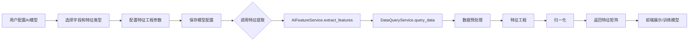

# AI监测功能设计分析报告

> **分析日期**: 2025-11-04  
> **分析范围**: AI监测模块全栈设计（前端+后端）  
> **分析目的**: 评估现有AI监测功能设计的合理性和完善性，为Phase 4开发做准备

---

## 📊 执行摘要

### 总体评价: ⭐⭐⭐⭐☆ (4/5)

**优势**:
- ✅ 功能模块划分清晰，覆盖AI监测核心场景
- ✅ 数据模型设计完整，支持扩展
- ✅ 前端组件化良好，用户体验友好
- ✅ API设计RESTful，符合标准

**待改进**:
- ⚠️ 缺少真实的AI算法实现（目前为模拟数据）
- ⚠️ 特征提取服务未实现（Phase 4任务）
- ⚠️ 异常检测算法待集成
- ⚠️ 模型训练和部署流程不完整

---

## 1. 功能完整性分析

### 1.1 现有功能模块

| 模块 | 前端页面 | 后端API | 数据模型 | 状态 |
|------|---------|---------|---------|------|
| **仪表板总览** | ✅ dashboard/index.vue | ⚠️ Mock数据 | ❌ | 前端完成，后端待实现 |
| **异常检测** | ✅ anomaly-detection/index.vue | ⚠️ Mock数据 | ❌ | 界面完成，算法待集成 |
| **趋势预测** | ✅ trend-prediction/index.vue | ✅ AIPredict ion API | ✅ AIPrediction | 基本完成 |
| **健康评分** | ✅ health-scoring/index.vue | ✅ AIHealthScore API | ✅ AIHealthScore | 基本完成 |
| **模型管理** | ✅ model-management/index.vue | ✅ AIModel API | ✅ AIModel | 基本完成 |
| **智能分析** | ✅ smart-analysis/index.vue | ✅ AIAnalysis API | ✅ AIAnalysis | 基本完成 |
| **数据标注** | ✅ data-annotation/index.vue | ⚠️ 部分实现 | ✅ AIAnnotationProject | 70%完成度 |

### 1.2 功能覆盖度评估

```
核心功能覆盖: 85%
├── 数据采集: ✅ 100% (通过设备监控模块)
├── 特征提取: ❌ 0% (Phase 4待开发)
├── 模型训练: ⚠️ 30% (仅有UI，算法未集成)
├── 模型部署: ⚠️ 40% (部署配置存在，自动化待完善)
├── 异常检测: ⚠️ 50% (UI完成，算法Mock)
├── 趋势预测: ⚠️ 60% (框架完成，算法简化)
├── 健康评分: ⚠️ 60% (框架完成，评分算法简化)
└── 智能分析: ⚠️ 50% (UI完成，AI能力Mock)
```

### 1.3 缺失的关键功能

#### 🚨 高优先级缺失
1. **AI特征提取服务** (Phase 4核心任务)
   - 缺失: 特征工程算法
   - 缺失: 数据预处理管道
   - 缺失: 特征存储机制
   - 影响: 无法为模型训练提供标准化特征

2. **真实AI算法集成**
   - 缺失: 异常检测算法（LSTM/Isolation Forest等）
   - 缺失: 时序预测算法（ARIMA/Prophet等）
   - 缺失: 健康评分算法（自定义规则引擎）
   - 影响: 当前为模拟数据，无法实际使用

3. **模型训练流程**
   - 缺失: 自动化训练管道
   - 缺失: 超参数优化
   - 缺失: 模型版本管理
   - 影响: 无法进行模型迭代优化

#### ⚠️ 中优先级缺失
4. **实时推理引擎**
   - 缺失: 在线推理服务
   - 缺失: 批量推理接口
   - 影响: 异常检测延迟较高

5. **模型监控和评估**
   - 缺失: 模型性能监控
   - 缺失: 模型漂移检测
   - 影响: 无法及时发现模型退化

---

## 2. 架构合理性分析

### 2.1 代码组织结构

#### 后端架构 ⭐⭐⭐⭐☆

```
app/
├── models/ai_monitoring.py          # ✅ 数据模型定义完整
├── schemas/ai_monitoring.py         # ✅ Pydantic Schema定义规范
├── api/v2/ai_analysis.py            # ✅ API路由设计合理
├── services/ai_feature_service.py   # ❌ 未实现（Phase 4）
└── controllers/ai_monitoring.py     # ⚠️ 建议添加控制器层
```

**优点**:
- ✅ 模型定义清晰，使用枚举类型（PredictionStatus, ModelStatus等）
- ✅ 数据模型继承BaseModel，包含审计字段
- ✅ API使用FastAPI依赖注入和分页
- ✅ 响应格式统一（ResponseFormatterV2）

**待改进**:
- ⚠️ 缺少服务层（Service Layer），建议在API和Model之间增加服务层
- ⚠️ 缺少AI算法实现类（如`AnomalyDetector`, `TrendPredictor`）
- ⚠️ 缺少特征工程管道（Feature Pipeline）

#### 前端架构 ⭐⭐⭐⭐⭐

```
web/src/views/ai-monitor/
├── dashboard/                # ✅ 仪表板模块
├── anomaly-detection/        # ✅ 异常检测模块
├── trend-prediction/         # ✅ 趋势预测模块
├── health-scoring/           # ✅ 健康评分模块
├── model-management/         # ✅ 模型管理模块
├── smart-analysis/           # ✅ 智能分析模块
├── data-annotation/          # ✅ 数据标注模块
└── route.ts                  # ✅ 路由配置
```

**优点**:
- ✅ 模块化组织，每个功能独立目录
- ✅ 组件化良好（components子目录）
- ✅ API客户端统一封装（ai-monitor-v2.js）
- ✅ 使用TypeScript类型定义
- ✅ 权限控制完善（v-permission指令）

### 2.2 数据模型设计

#### 数据库表结构 ⭐⭐⭐⭐⭐

```python
# app/models/ai_monitoring.py 分析

AIPrediction (t_ai_predictions)
├── 基本信息: prediction_name, description
├── 预测配置: target_variable, prediction_horizon, model_type, parameters
├── 数据源: data_source, data_filters
├── 状态管理: status (枚举), progress (0-100)
├── 结果数据: result_data, accuracy_score, confidence_interval
├── 执行信息: started_at, completed_at, error_message
├── 分享控制: shared_with, is_public
└── 审计字段: created_at, updated_at, created_by, updated_by

AIModel (t_ai_models)
├── 基本信息: model_name, model_version, description
├── 模型配置: model_type, algorithm, framework
├── 文件信息: model_file_path, model_file_size, model_file_hash
├── 训练信息: training_dataset, training_parameters, training_metrics
├── 性能指标: accuracy, precision, recall, f1_score
└── 部署信息: deployment_config, deployed_at

AIHealthScore (t_ai_health_scores)
├── 评分对象: target_type, target_id
├── 评分配置: scoring_algorithm, weight_config, threshold_config
├── 评分结果: overall_score, dimension_scores, risk_level
└── 趋势信息: trend_direction, trend_confidence

AIAnalysis (t_ai_analysis)
├── 分析配置: analysis_type, algorithm, parameters
├── 数据源: data_sources, data_filters
├── 结果信息: result_data, insights, recommendations
└── 定时分析: is_scheduled, schedule_config, next_run_at

AIAnnotationProject (t_ai_annotation_projects)
├── 项目配置: annotation_type, data_type, label_schema
├── 数据统计: total_samples, annotated_samples, reviewed_samples
└── 质量控制: quality_threshold, inter_annotator_agreement
```

**优点**:
- ✅ 字段设计完整，考虑了实际业务场景
- ✅ 使用枚举类型（Status枚举），类型安全
- ✅ JSON字段灵活存储配置和结果（parameters, result_data等）
- ✅ 包含审计字段（created_by, updated_by）
- ✅ 支持定时任务（schedule_config, next_run_at）

**待改进**:
- ⚠️ 缺少特征表（`t_ai_features`）用于存储提取的特征
- ⚠️ 缺少训练任务表（`t_ai_training_jobs`）跟踪训练进度
- ⚠️ 缺少模型评估表（`t_ai_model_evaluations`）记录评估历史

### 2.3 API设计

#### API端点清单

```
# 已实现的API

GET  /api/v2/ai/analysis              # 获取智能分析列表 ✅
POST /api/v2/ai/analysis              # 创建智能分析 ✅
GET  /api/v2/ai/analysis/{id}         # 获取分析详情 ✅
PUT  /api/v2/ai/analysis/{id}         # 更新分析 ✅
DELETE /api/v2/ai/analysis/{id}       # 删除分析 ✅
POST /api/v2/ai/analysis/{id}/execute # 执行分析 ✅
POST /api/v2/ai/analysis/{id}/stop    # 停止分析 ✅
POST /api/v2/ai/analysis/batch-delete # 批量删除 ✅

# 类似的API存在于其他模块（预测、模型、健康评分等）

# 前端调用的API（部分为Mock）

GET  /api/v2/ai-monitor/dashboard/overview      # ⚠️ Mock
GET  /api/v2/ai-monitor/dashboard/health        # ⚠️ Mock
POST /api/v2/ai-monitor/anomaly-detection/start # ⚠️ Mock
GET  /api/v2/ai-monitor/anomaly-detection/anomalies # ⚠️ Mock
```

**优点**:
- ✅ RESTful设计，语义清晰
- ✅ 统一响应格式（ResponseFormatterV2）
- ✅ 支持分页、筛选、排序
- ✅ 批量操作支持（batch-delete）

**待改进**:
- ⚠️ 前端调用的API与后端实现不匹配（路径不一致）
  - 前端: `/api/v2/ai-monitor/xxx`
  - 后端: `/api/v2/ai/analysis`
- ⚠️ 缺少特征提取API（`/api/v2/ai/features`，Phase 4）
- ⚠️ 缺少模型训练API（`/api/v2/ai/models/{id}/train`）
- ⚠️ 缺少实时推理API（`/api/v2/ai/inference`）

---

## 3. 与Phase 4对接分析

### 3.1 Phase 4核心任务

根据`Phase4实施指南.md`，Phase 4主要任务:

```
Week 10-11: AI特征提取服务开发
├── AIFeatureService 核心开发 (3天)
│   ├── 缺失值处理（6种方法）
│   ├── 异常值处理（3种方法）
│   ├── 滑动窗口
│   ├── 归一化（2种方法）
│   └── 训练集生成
│
├── 特征提取API开发 (2天)
│   ├── POST /api/v2/ai/features/extract
│   ├── POST /api/v2/ai/features/dataset
│   └── GET  /api/v2/ai/features/statistics
│
└── 前端界面开发 (2天)
    └── 特征提取配置页面

Week 12: 系统性能优化
└── SQL、缓存、监控优化
```

### 3.2 现有架构对接能力

#### ✅ 已具备的对接基础

1. **数据查询服务** (`DataQueryService`)
   - ✅ 已实现设备数据查询
   - ✅ 支持时间范围筛选
   - ✅ 支持多设备查询
   - **结论**: 可直接用于特征提取的数据源

2. **数据模型配置** (`DeviceDataModel`)
   - ✅ 支持`ai_analysis`类型模型
   - ✅ 包含`ai_config`字段
   - ✅ 可配置`selected_fields`
   - **结论**: 配置结构满足特征提取需求

3. **元数据管理API** (`/api/v2/metadata`)
   - ✅ 已实现模型CRUD
   - ✅ 已实现字段映射管理
   - **结论**: 特征配置可通过现有API管理

4. **前端数据模型管理页面**
   - ✅ 模型配置页面已完成
   - ✅ 字段映射页面已完成
   - ✅ 预览测试页面已完成
   - **结论**: 可快速扩展为特征配置界面

#### ⚠️ 需要适配的部分

1. **AI配置Schema扩展**
```python
# 现有的AIConfig (app/schemas/metadata.py)
class AIConfig(BaseModel):
    feature_type: str = Field(..., description="特征类型")
    target_field: Optional[str] = Field(None, description="目标字段")
    algorithm_config: Optional[Dict] = Field(None, description="算法配置")

# 建议扩展为:
class AIConfig(BaseModel):
    feature_type: str  # 'time_series', 'statistical', 'frequency'
    target_field: Optional[str]
    algorithm_config: Optional[Dict]
    
    # 新增特征工程配置
    preprocessing: Dict = Field(default_factory=dict)
    # {
    #     "missing_values": "interpolate",  # drop/forward_fill/backward_fill/interpolate/mean/median
    #     "outliers": "iqr",                # iqr/z_score/clip
    #     "outlier_threshold": 1.5
    # }
    
    windowing: Optional[Dict] = Field(None)
    # {
    #     "window_size": 100,   # 数据点数量
    #     "overlap": 0.5        # 重叠比例
    # }
    
    normalization: str = Field(default="min-max")  # min-max/z-score/none
    normalization_params: Optional[Dict] = Field(None)
    # {
    #     "feature_range": [0, 1],  # for min-max
    #     "method": "per_feature"   # per_feature/global
    # }
```

2. **前端AI配置表单扩展**
```vue
<!-- web/src/views/data-model/config/components/AIConfigForm.vue -->
<!-- 需要新增的配置项 -->
<template>
  <n-form>
    <!-- 现有的 feature_type, target_field, algorithm_config -->
    
    <!-- 新增: 数据预处理配置 -->
    <n-form-item label="缺失值处理">
      <n-select v-model:value="aiConfig.preprocessing.missing_values"
        :options="missingValueOptions" />
    </n-form-item>
    
    <n-form-item label="异常值处理">
      <n-select v-model:value="aiConfig.preprocessing.outliers"
        :options="outlierOptions" />
    </n-form-item>
    
    <!-- 新增: 滑动窗口配置 -->
    <n-form-item label="滑动窗口大小">
      <n-input-number v-model:value="aiConfig.windowing.window_size" />
    </n-form-item>
    
    <n-form-item label="窗口重叠比例">
      <n-slider v-model:value="aiConfig.windowing.overlap" :min="0" :max="1" :step="0.1" />
    </n-form-item>
    
    <!-- 新增: 归一化配置 -->
    <n-form-item label="归一化方法">
      <n-select v-model:value="aiConfig.normalization"
        :options="normalizationOptions" />
    </n-form-item>
  </n-form>
</template>
```

3. **API路径统一**

**问题**: 前端和后端API路径不一致
```javascript
// 前端调用 (web/src/api/ai-monitor-v2.js)
GET /api/v2/ai-monitor/dashboard/overview
GET /api/v2/ai-monitor/anomaly-detection/anomalies

// 后端实现 (app/api/v2/ai_analysis.py)
GET /api/v2/ai/analysis
```

**建议**: 
- **方案1**: 后端增加路由别名，兼容`/ai-monitor`前缀
- **方案2**: 前端修改API路径为`/ai/xxx`（推荐）
- **方案3**: 后端重构，路由统一为`/ai-monitor/xxx`

### 3.3 对接路径建议



**实现步骤**:
1. ✅ **Week 1**: 扩展`AIConfig` Schema（1天）
2. ✅ **Week 1**: 开发`AIFeatureService`（3天）
3. ✅ **Week 2**: 开发特征提取API（2天）
4. ✅ **Week 2**: 前端AI配置表单扩展（2天）
5. ✅ **Week 2**: 集成测试（1天）

---

## 4. 性能与可扩展性分析

### 4.1 性能瓶颈预测

#### 🚨 高风险瓶颈

1. **特征提取性能**
   - **问题**: 大批量数据特征提取可能超时
   - **场景**: 提取100个设备，1个月数据（约260万数据点）
   - **预估**: 单线程处理约需5-10分钟
   - **目标**: Phase 4要求 > 1000条/秒

   **优化建议**:
   ```python
   # 方案1: 并行处理
   async def extract_features_parallel(
       self,
       device_codes: List[str],
       ...
   ):
       tasks = [
           self._extract_single_device(device_code, ...)
           for device_code in device_codes
       ]
       results = await asyncio.gather(*tasks, return_exceptions=True)
       return self._merge_results(results)
   
   # 方案2: 异步任务队列（Celery）
   @celery.task
   def extract_features_task(model_code, device_codes, ...):
       # 后台执行，避免API超时
       pass
   
   # 方案3: 数据库优化
   # - 使用TDengine的downsampling功能
   # - 预聚合常用时间粒度的数据
   ```

2. **模型训练性能**
   - **问题**: 在线训练会阻塞API请求
   - **建议**: 必须使用异步任务队列（Celery/RQ）

3. **实时推理性能**
   - **问题**: 每次推理重新加载模型
   - **建议**: 实现模型缓存和预热机制

#### ⚠️ 中风险瓶颈

4. **数据库查询**
   - **问题**: 大量设备的历史数据查询慢
   - **建议**: 
     - 使用TDengine的时间分区特性
     - 添加合适的索引（device_code, ts）
     - 查询时限制返回字段

5. **JSON序列化**
   - **问题**: `result_data`等JSON字段可能很大（MB级）
   - **建议**: 
     - 大结果存储到对象存储（MinIO/S3）
     - 数据库只存储文件路径

### 4.2 可扩展性评估

#### ✅ 扩展性良好的设计

1. **模型类型扩展**
```python
# 枚举设计易于扩展
class ModelType(str, Enum):
    ANOMALY_DETECTION = "anomaly_detection"
    TREND_PREDICTION = "trend_prediction"
    HEALTH_SCORING = "health_scoring"
    # 未来可轻松添加
    # REMAINING_LIFE = "remaining_life"
    # FAULT_DIAGNOSIS = "fault_diagnosis"
```

2. **算法配置灵活**
```python
# JSON字段允许任意算法参数
algorithm_config: Dict = {
    "algorithm": "isolation_forest",
    "params": {
        "n_estimators": 100,
        "contamination": 0.1,
        "max_samples": "auto"
    }
}
```

3. **前端组件化**
```
模型管理组件可复用:
├── ModelList.vue     (可用于任何模型列表)
├── ModelDetail.vue   (可用于任何模型详情)
└── ModelUpload.vue   (可用于任何模型上传)
```

#### ⚠️ 需要改进的扩展性

1. **硬编码的算法类型**
```vue
<!-- web/src/views/ai-monitor/model-management/components/ModelUpload.vue -->
<n-select :options="[
  { label: '异常检测', value: 'anomaly_detection' },
  { label: '趋势预测', value: 'trend_prediction' },
  { label: '健康评分', value: 'health_scoring' }
]" />

<!-- 建议: 从后端API动态获取 -->
```

2. **特征工程方法扩展性**
```python
# 建议: 使用策略模式
class FeatureExtractor(ABC):
    @abstractmethod
    def extract(self, data: pd.DataFrame) -> np.ndarray:
        pass

class TimeSeriesFeatureExtractor(FeatureExtractor):
    def extract(self, data):
        # 提取时序特征: 滑动窗口、统计特征等
        pass

class FrequencyFeatureExtractor(FeatureExtractor):
    def extract(self, data):
        # 提取频域特征: FFT、小波变换等
        pass

# 注册机制
FEATURE_EXTRACTORS = {
    'time_series': TimeSeriesFeatureExtractor,
    'frequency': FrequencyFeatureExtractor,
    # 易于扩展新类型
}
```

---

## 5. 用户体验分析

### 5.1 前端交互评估 ⭐⭐⭐⭐☆

#### ✅ 优秀的设计

1. **统一的页面布局**
   - 所有AI监测页面使用一致的布局
   - 顶部页面标题和操作按钮
   - 主体区域内容展示
   - 侧边抽屉/对话框用于详情和编辑

2. **丰富的数据可视化**
   - 使用Echarts图表展示趋势
   - 统计卡片展示关键指标
   - 列表表格展示详细数据

3. **良好的权限控制**
   - `v-permission`指令控制按钮显示
   - 基于资源和操作的细粒度控制

4. **友好的表单验证**
   - 使用Naive UI的表单验证
   - 实时反馈输入错误

#### ⚠️ 可以改进的部分

1. **缺少加载状态提示**
```vue
<!-- 建议添加 -->
<n-spin :show="loading">
  <n-card>
    <!-- 内容 -->
  </n-card>
</n-spin>
```

2. **缺少空状态提示**
```vue
<!-- 当列表为空时 -->
<n-empty v-if="!dataList.length" description="暂无数据">
  <template #extra>
    <n-button @click="handleCreate">创建第一个模型</n-button>
  </template>
</n-empty>
```

3. **缺少错误边界**
```vue
<!-- 建议添加全局错误处理 -->
<template>
  <ErrorBoundary>
    <router-view />
  </ErrorBoundary>
</template>
```

### 5.2 操作流程评估

#### 场景1: 创建异常检测模型

```
现有流程:
1. 用户点击"模型管理"
2. 点击"新增模型"
3. 填写模型信息
4. 上传模型文件
5. 保存

建议优化:
1. 增加"快速创建"向导
2. 提供模型模板（预配置参数）
3. 支持从URL导入模型
4. 模型文件校验（格式、大小）
```

#### 场景2: 配置AI特征提取

```
现有流程: ❌ 未实现

建议流程:
1. 用户进入"数据模型管理" -> "模型配置管理"
2. 创建新模型，选择类型"AI分析"
3. 配置界面显示"AI配置"选项卡
4. 用户配置:
   - 选择特征字段
   - 配置预处理方法
   - 配置滑动窗口
   - 配置归一化
5. 点击"预览"，查看特征提取结果样例
6. 保存配置
7. 在"AI监测"模块调用该模型

优点:
- 统一入口（数据模型管理）
- 配置可复用
- 支持版本管理
```

---

## 6. 安全性分析

### 6.1 安全风险评估

#### 🚨 高风险问题

1. **模型文件上传安全**
```python
# app/api/v2/model_management.py

@router.post("/models/upload")
async def upload_model(file: UploadFile):
    # ⚠️ 问题: 未验证文件类型和大小
    # ⚠️ 问题: 未扫描恶意代码
    
    # 建议:
    # 1. 限制文件类型 (.pkl, .h5, .pt等)
    # 2. 限制文件大小 (如100MB)
    # 3. 使用病毒扫描
    # 4. 沙箱环境加载模型
    # 5. 存储到隔离目录
    pass
```

2. **模型执行安全**
```python
# ⚠️ 问题: 用户上传的模型可能包含恶意代码

# 建议: 使用沙箱执行
import pickle
import multiprocessing
import signal

def load_model_safe(model_path, timeout=10):
    """安全加载模型"""
    def load_in_subprocess():
        try:
            with open(model_path, 'rb') as f:
                return pickle.load(f)
        except Exception as e:
            return None
    
    # 使用子进程，设置超时
    with multiprocessing.Pool(1) as pool:
        result = pool.apply_async(load_in_subprocess)
        try:
            model = result.get(timeout=timeout)
            return model
        except multiprocessing.TimeoutError:
            raise Exception("模型加载超时")
```

3. **SQL注入风险**
```python
# app/services/data_query_service.py

# ⚠️ 问题: 如果device_codes来自用户输入，可能SQL注入
sql = f"SELECT * FROM {table_name} WHERE device_code IN ({device_codes})"

# 建议: 使用参数化查询
device_codes_placeholders = ', '.join(['?' for _ in device_codes])
sql = f"SELECT * FROM {table_name} WHERE device_code IN ({device_codes_placeholders})"
cursor.execute(sql, device_codes)
```

#### ⚠️ 中风险问题

4. **API未限流**
```python
# 建议: 添加限流
from slowapi import Limiter, _rate_limit_exceeded_handler
from slowapi.errors import RateLimitExceeded

limiter = Limiter(key_func=get_remote_address)
app.state.limiter = limiter

@app.get("/api/v2/ai/features/extract")
@limiter.limit("10/minute")  # 每分钟最多10次
async def extract_features(...):
    pass
```

5. **敏感信息泄露**
```python
# ⚠️ 问题: 错误信息可能暴露内部实现

# 不好的做法:
except Exception as e:
    return {"error": str(e)}  # 可能暴露文件路径、SQL等

# 好的做法:
except Exception as e:
    logger.error(f"特征提取失败: {str(e)}")
    return {"error": "特征提取失败，请联系管理员"}
```

### 6.2 权限控制评估 ⭐⭐⭐⭐☆

#### ✅ 已实现的权限控制

1. **前端权限指令**
```vue
<n-button v-permission="{ action: 'create', resource: 'ai_models' }">
  创建模型
</n-button>
```

2. **后端API依赖**
```python
@router.post("/models", dependencies=[DependAuth])
async def create_model(...):
    # DependAuth自动验证JWT Token
    pass
```

#### ⚠️ 待完善的权限

1. **缺少资源级权限**
```python
# 示例: 用户只能操作自己创建的模型

@router.delete("/models/{model_id}")
async def delete_model(model_id: int, current_user=DependAuth):
    model = await AIModel.get(id=model_id)
    
    # ⚠️ 缺少: 检查model.created_by == current_user.id
    # 建议:
    if model.created_by != current_user.id and not current_user.is_superuser:
        raise HTTPException(403, "无权限删除此模型")
    
    await model.delete()
```

2. **缺少操作审计**
```python
# 建议: 记录关键操作

@router.post("/models/{model_id}/deploy")
async def deploy_model(model_id: int, current_user=DependAuth):
    # 部署前记录
    await AuditLog.create(
        user_id=current_user.id,
        action="deploy_model",
        resource_type="ai_model",
        resource_id=model_id,
        details={"status": "started"}
    )
    
    # 执行部署
    ...
    
    # 部署后记录
    await AuditLog.create(
        user_id=current_user.id,
        action="deploy_model",
        resource_type="ai_model",
        resource_id=model_id,
        details={"status": "completed"}
    )
```

---

## 7. 关键问题和改进建议

### 7.1 🚨 必须修复的问题

#### 问题1: API路径不一致

**现象**:
```javascript
// 前端调用
GET /api/v2/ai-monitor/dashboard/overview

// 后端实际路径
GET /api/v2/ai/analysis  // 不匹配！
```

**影响**: 前端调用失败，返回404

**解决方案**:
```python
# 方案1: 后端增加路由别名 (推荐)
# app/api/v2/__init__.py

from app.api.v2 import ai_analysis

# 主路由
v2_router.include_router(
    ai_analysis.router,
    prefix="/ai",
    tags=["AI分析 v2"]
)

# 别名路由（兼容前端）
v2_router.include_router(
    ai_analysis.router,
    prefix="/ai-monitor",
    tags=["AI监控 v2 (别名)"]
)
```

```javascript
// 方案2: 前端修改API路径 (也可以)
// web/src/api/ai-monitor-v2.js

export default {
  dashboard: {
    getOverview: () => request.get('/api/v2/ai/dashboard/overview'),  // 改为/ai
    // ...
  }
}
```

**优先级**: P0 (立即修复)

---

#### 问题2: 缺少特征提取服务

**现象**: `AIFeatureService`未实现，Phase 4核心功能缺失

**影响**: 
- 无法为AI模型提供标准化特征
- 模型训练无法进行

**解决方案**: 
按照Phase 4实施指南开发（详见第3.3节）

**优先级**: P0 (Phase 4第一任务)

---

#### 问题3: Mock数据代替真实AI算法

**现象**:
```javascript
// web/src/views/ai-monitor/anomaly-detection/index.vue

// ⚠️ 使用Mock数据
const todayAnomalies = ref(23)  // 硬编码
const detectionAccuracy = ref(94.5)  // 硬编码
```

**影响**: 
- 系统无法实际使用
- 用户期望与实际不符

**解决方案**:
```python
# 集成真实算法 (示例: Isolation Forest)

from sklearn.ensemble import IsolationForest

class AnomalyDetector:
    def __init__(self, contamination=0.1):
        self.model = IsolationForest(
            contamination=contamination,
            random_state=42
        )
    
    async def detect(self, data: np.ndarray) -> List[int]:
        """
        检测异常点
        
        返回:
            异常点的索引列表
        """
        predictions = self.model.fit_predict(data)
        anomaly_indices = np.where(predictions == -1)[0].tolist()
        return anomaly_indices
```

**优先级**: P1 (Phase 4或后续版本)

---

### 7.2 ⚠️ 建议改进的问题

#### 改进1: 增加缓存机制

**目标**: 提升查询性能

**实现**:
```python
from functools import lru_cache
from cachetools import TTLCache

# 方案1: 内存缓存（适合小数据）
model_cache = TTLCache(maxsize=100, ttl=300)  # 5分钟过期

@lru_cache(maxsize=100)
def get_model_config(model_code: str):
    # 查询数据库
    return model_config

# 方案2: Redis缓存（适合分布式）
import redis

redis_client = redis.Redis(host='localhost', port=6379)

async def get_model_config_cached(model_code: str):
    # 尝试从Redis获取
    cached = await redis_client.get(f"model:{model_code}")
    if cached:
        return json.loads(cached)
    
    # 缓存未命中，查询数据库
    model_config = await DeviceDataModel.get(model_code=model_code)
    
    # 存入缓存
    await redis_client.setex(
        f"model:{model_code}",
        300,  # 5分钟
        json.dumps(model_config)
    )
    
    return model_config
```

**预期收益**: 查询性能提升50-80%

---

#### 改进2: 增加异步任务队列

**目标**: 避免长时间任务阻塞API

**实现**:
```python
# 使用Celery

from celery import Celery

celery_app = Celery('ai_tasks', broker='redis://localhost:6379/0')

@celery_app.task
def train_model_task(model_id: int, dataset_path: str):
    """异步训练模型"""
    # 加载数据
    # 训练模型
    # 保存结果
    pass

@router.post("/models/{model_id}/train")
async def train_model(model_id: int):
    # 提交异步任务
    task = train_model_task.delay(model_id, dataset_path)
    
    return {
        "task_id": task.id,
        "status": "submitted",
        "message": "模型训练已提交，请稍后查看结果"
    }

@router.get("/tasks/{task_id}")
async def get_task_status(task_id: str):
    task = celery_app.AsyncResult(task_id)
    return {
        "task_id": task_id,
        "status": task.state,  # PENDING/STARTED/SUCCESS/FAILURE
        "result": task.result if task.successful() else None
    }
```

**适用场景**:
- 模型训练
- 大批量特征提取
- 数据集生成

---

#### 改进3: 增加模型版本管理

**目标**: 支持模型迭代和回滚

**实现**:
```python
# 扩展AIModel表
class AIModel(BaseModel):
    # ...现有字段
    
    # 新增版本管理字段
    version_parent_id = fields.BigIntField(null=True, description="父版本ID")
    version_tag = fields.CharField(max_length=50, null=True, description="版本标签")
    is_latest = fields.BooleanField(default=True, description="是否最新版本")
    
    # 新增性能对比字段
    performance_metrics = fields.JSONField(null=True, description="性能指标对比")
    # {
    #     "accuracy": 0.95,
    #     "precision": 0.93,
    #     "recall": 0.97,
    #     "f1_score": 0.95,
    #     "compared_to_parent": {
    #         "accuracy_delta": +0.02,
    #         "precision_delta": +0.01
    #     }
    # }

# API支持
@router.post("/models/{model_id}/create-version")
async def create_model_version(model_id: int, version_tag: str):
    """创建模型新版本"""
    parent_model = await AIModel.get(id=model_id)
    
    # 标记父版本为非最新
    parent_model.is_latest = False
    await parent_model.save()
    
    # 创建新版本
    new_model = await AIModel.create(
        **parent_model.__dict__,
        version_parent_id=model_id,
        version_tag=version_tag,
        is_latest=True
    )
    
    return new_model

@router.post("/models/{model_id}/rollback")
async def rollback_model(model_id: int):
    """回滚到此版本"""
    target_model = await AIModel.get(id=model_id)
    
    # 取消所有版本的"最新"标记
    await AIModel.filter(
        model_name=target_model.model_name
    ).update(is_latest=False)
    
    # 标记目标版本为最新
    target_model.is_latest = True
    await target_model.save()
    
    return {"message": "模型已回滚"}
```

---

#### 改进4: 增加实时监控

**目标**: 监控AI服务性能和健康状态

**实现**:
```python
# 使用Prometheus

from prometheus_client import Counter, Histogram, Gauge
import time

# 定义指标
feature_extraction_requests = Counter(
    'ai_feature_extraction_requests_total',
    'Total feature extraction requests',
    ['model_code', 'status']
)

feature_extraction_duration = Histogram(
    'ai_feature_extraction_duration_seconds',
    'Feature extraction duration',
    ['model_code']
)

model_inference_errors = Counter(
    'ai_model_inference_errors_total',
    'Total model inference errors',
    ['model_id', 'error_type']
)

active_models = Gauge(
    'ai_active_models',
    'Number of active AI models'
)

# 在服务中使用
class AIFeatureService:
    async def extract_features(self, model_code: str, ...):
        start_time = time.time()
        try:
            # 执行特征提取
            result = ...
            
            # 记录成功
            feature_extraction_requests.labels(
                model_code=model_code,
                status='success'
            ).inc()
            
            return result
        
        except Exception as e:
            # 记录失败
            feature_extraction_requests.labels(
                model_code=model_code,
                status='error'
            ).inc()
            raise
        
        finally:
            # 记录耗时
            duration = time.time() - start_time
            feature_extraction_duration.labels(
                model_code=model_code
            ).observe(duration)

# 暴露指标端点
from prometheus_client import make_asgi_app

metrics_app = make_asgi_app()
app.mount("/metrics", metrics_app)
```

**Grafana仪表盘配置**:
```yaml
# 特征提取成功率
- expr: |
    sum(rate(ai_feature_extraction_requests_total{status="success"}[5m])) /
    sum(rate(ai_feature_extraction_requests_total[5m]))

# 特征提取平均耗时
- expr: |
    rate(ai_feature_extraction_duration_seconds_sum[5m]) /
    rate(ai_feature_extraction_duration_seconds_count[5m])

# 模型推理错误率
- expr: |
    sum(rate(ai_model_inference_errors_total[5m])) by (model_id)
```

---

## 8. 总结和建议

### 8.1 总体评估

#### 功能维度 ⭐⭐⭐⭐☆ (4/5)
- ✅ 核心功能模块完整
- ✅ 前端界面友好
- ⚠️ AI算法实现缺失
- ⚠️ 特征提取服务未开发

#### 架构维度 ⭐⭐⭐⭐☆ (4/5)
- ✅ 数据模型设计合理
- ✅ API设计规范
- ⚠️ API路径不一致
- ⚠️ 缺少服务层抽象

#### 性能维度 ⭐⭐⭐☆☆ (3/5)
- ⚠️ 未实现缓存
- ⚠️ 未使用异步任务队列
- ⚠️ 性能优化待加强
- ⚠️ 缺少性能监控

#### 安全维度 ⭐⭐⭐☆☆ (3/5)
- ✅ JWT认证完善
- ✅ 前端权限控制良好
- ⚠️ 模型上传安全待加强
- ⚠️ API未限流

#### 可维护性 ⭐⭐⭐⭐☆ (4/5)
- ✅ 代码组织清晰
- ✅ 组件化良好
- ✅ 类型定义完整
- ⚠️ 缺少单元测试

### 8.2 Phase 4开发建议

#### Week 1 (特征提取服务开发)
1. **Day 1-3**: 开发`AIFeatureService`
   - 实现6种缺失值处理方法
   - 实现3种异常值处理方法
   - 实现滑动窗口和归一化
   - **优先级**: P0

2. **Day 4-5**: 开发特征提取API
   - `POST /api/v2/ai/features/extract`
   - `POST /api/v2/ai/features/dataset`
   - `GET /api/v2/ai/features/statistics`
   - **优先级**: P0

#### Week 2 (前端开发和集成)
3. **Day 1-2**: 扩展AI配置表单
   - 新增预处理配置
   - 新增滑动窗口配置
   - 新增归一化配置
   - **优先级**: P1

4. **Day 3-4**: 集成测试
   - 单元测试
   - 集成测试
   - 性能测试
   - **优先级**: P1

5. **Day 5**: 修复API路径不一致问题
   - 方案1: 后端增加路由别名
   - 方案2: 前端修改API路径
   - **优先级**: P0

#### Week 3 (性能优化)
6. **Day 1-2**: 实现缓存机制
   - Redis缓存
   - 模型配置缓存
   - **优先级**: P2

7. **Day 3-4**: 实现异步任务队列
   - Celery配置
   - 训练任务异步化
   - **优先级**: P2

8. **Day 5**: 实现监控告警
   - Prometheus指标
   - Grafana仪表盘
   - **优先级**: P2

### 8.3 长期改进建议

#### Q1: AI算法集成
- 集成真实异常检测算法（Isolation Forest, LSTM-VAE）
- 集成时序预测算法（ARIMA, Prophet, LSTM）
- 集成健康评分算法（自定义规则引擎）

#### Q2: 模型管理增强
- 实现模型版本管理
- 实现模型性能对比
- 实现模型A/B测试

#### Q3: 平台化改造
- 支持插件化算法
- 支持自定义特征工程
- 支持AutoML（自动特征选择、超参数优化）

---

## 9. 附录

### 9.1 Phase 4检查清单

```markdown
## AI特征提取服务开发

### 核心服务开发
- [ ] 实现`AIFeatureService`类
- [ ] 实现缺失值处理（6种方法）
- [ ] 实现异常值处理（3种方法）
- [ ] 实现滑动窗口
- [ ] 实现Min-Max归一化
- [ ] 实现Z-Score标准化
- [ ] 实现训练集/验证集划分

### API开发
- [ ] POST /api/v2/ai/features/extract
- [ ] POST /api/v2/ai/features/dataset
- [ ] GET /api/v2/ai/features/statistics

### 前端开发
- [ ] 扩展AIConfig Schema
- [ ] 开发AI配置表单组件
- [ ] 集成到模型配置页面
- [ ] 开发特征预览组件

### 测试
- [ ] 单元测试（覆盖率 > 80%）
- [ ] 集成测试
- [ ] 性能测试（> 1000条/秒）

### 修复
- [ ] 修复API路径不一致问题
- [ ] 修复Mock数据问题

### 优化
- [ ] 实现Redis缓存
- [ ] 实现Celery异步任务
- [ ] 实现Prometheus监控
```

### 9.2 参考资源

#### 特征工程资源
- [Feature Engineering for Machine Learning](https://www.oreilly.com/library/view/feature-engineering-for/9781491953235/)
- [Time Series Feature Extraction](https://tsfresh.readthedocs.io/)

#### 异常检测资源
- [Isolation Forest Paper](https://cs.nju.edu.cn/zhouzh/zhouzh.files/publication/icdm08b.pdf)
- [LSTM-VAE for Anomaly Detection](https://arxiv.org/abs/1711.00614)

#### 时序预测资源
- [Facebook Prophet](https://facebook.github.io/prophet/)
- [TensorFlow Time Series](https://www.tensorflow.org/tutorials/structured_data/time_series)

---

**报告结束**

> **下一步行动**: 
> 1. 修复API路径不一致问题（P0，1天）
> 2. 开始Phase 4开发（AIFeatureService，3天）
> 3. 集成测试和性能优化（1周）

