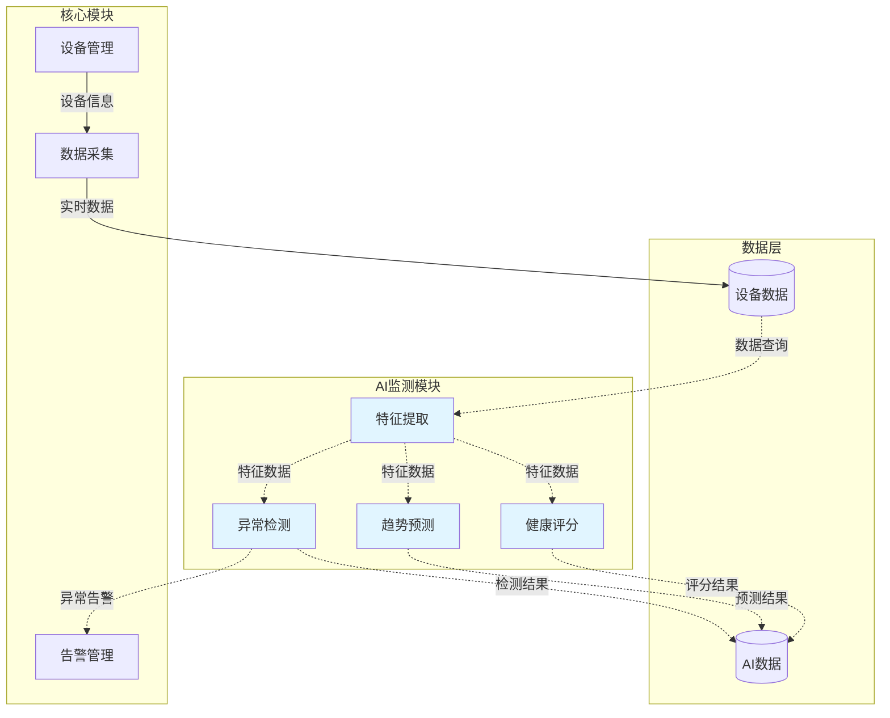

# AI监测模块化设计方案

> **版本**: v1.0  
> **日期**: 2025-11-04  
> **目的**: 将AI监测功能设计为可插拔、可配置的独立模块

---

## 📋 目录

1. [设计目标](#设计目标)
2. [架构设计](#架构设计)
3. [模块独立性设计](#模块独立性设计)
4. [功能开关控制](#功能开关控制)
5. [资源消耗优化](#资源消耗优化)
6. [实施方案](#实施方案)
7. [部署配置](#部署配置)

---

## 1. 设计目标

### 1.1 核心目标

#### ✅ **模块化**
- AI监测作为独立模块，与核心业务解耦
- 支持模块的独立开发、测试、部署
- 模块可以在不影响核心功能的情况下启用/禁用

#### ✅ **可配置性**
- 通过配置文件控制AI功能启用/禁用
- 支持细粒度的功能开关（如只启用异常检测，不启用趋势预测）
- 配置可动态加载，无需重启服务

#### ✅ **资源优化**
- AI功能禁用时，不加载相关Python库（节省内存）
- AI功能禁用时，不启动相关后台任务（节省CPU）
- AI功能禁用时，数据库表可选不创建（节省存储）

#### ✅ **易维护性**
- 清晰的模块边界，便于团队分工
- 独立的版本管理，可以单独升级AI模块
- 完善的降级策略，AI模块故障不影响核心业务

---

## 2. 架构设计

### 2.1 整体架构

```
DeviceMonitor 系统
│
├── 核心模块 (Core Modules) - 必需
│   ├── 设备管理 (Device Management)
│   ├── 实时监控 (Real-time Monitoring)
│   ├── 告警管理 (Alarm Management)
│   ├── 用户权限 (User & Permission)
│   └── 数据采集 (Data Collection)
│
└── 扩展模块 (Extension Modules) - 可选
    │
    ├── AI监测模块 (AI Monitoring Module) ⭐ 新增
    │   ├── 核心服务 (Core Services)
    │   │   ├── 特征提取服务 (Feature Extraction)
    │   │   ├── 异常检测服务 (Anomaly Detection)
    │   │   ├── 趋势预测服务 (Trend Prediction)
    │   │   ├── 健康评分服务 (Health Scoring)
    │   │   └── 智能分析服务 (Smart Analysis)
    │   │
    │   ├── 数据层 (Data Layer)
    │   │   ├── AI数据模型 (AI Models in DB)
    │   │   └── 特征存储 (Feature Storage)
    │   │
    │   ├── API层 (API Layer)
    │   │   └── /api/v2/ai/* (AI相关API)
    │   │
    │   └── 前端模块 (Frontend Module)
    │       └── /ai-monitor/* (AI监测页面)
    │
    ├── 报表模块 (未来)
    ├── 工作流模块 (未来)
    └── ...
```

### 2.2 模块交互设计



**设计原则**:
- **单向依赖**: AI模块依赖核心模块，核心模块不依赖AI模块
- **松耦合**: 通过事件/消息队列通信，而非直接调用
- **可降级**: AI模块故障时，核心功能不受影响

---

## 3. 模块独立性设计

### 3.1 目录结构

```
DeviceMonitorV2/
├── app/
│   ├── core/                    # 核心模块
│   │   ├── init_app.py
│   │   ├── dependency.py
│   │   └── ...
│   │
│   ├── models/
│   │   ├── admin.py             # 核心数据模型
│   │   ├── device.py
│   │   └── ai_monitoring.py     # AI模块数据模型 (可选加载)
│   │
│   ├── api/
│   │   ├── v2/
│   │   │   ├── devices.py       # 核心API
│   │   │   ├── alarms.py
│   │   │   └── ai/              # AI模块API (独立目录)
│   │   │       ├── __init__.py
│   │   │       ├── features.py
│   │   │       ├── anomaly.py
│   │   │       ├── prediction.py
│   │   │       └── analysis.py
│   │
│   ├── services/
│   │   ├── device_service.py    # 核心服务
│   │   └── ai/                  # AI模块服务 (独立目录)
│   │       ├── __init__.py
│   │       ├── feature_service.py
│   │       ├── anomaly_detector.py
│   │       ├── trend_predictor.py
│   │       └── health_scorer.py
│   │
│   ├── ai_module/               # ⭐ AI模块入口
│   │   ├── __init__.py          # 模块初始化
│   │   ├── config.py            # AI配置
│   │   ├── router.py            # AI路由注册
│   │   ├── loader.py            # 延迟加载器
│   │   └── registry.py          # 服务注册表
│   │
│   └── settings/
│       ├── base.py
│       └── ai_settings.py       # AI模块配置
│
├── web/src/
│   ├── views/
│   │   ├── device/              # 核心页面
│   │   └── ai-monitor/          # AI模块页面 (独立目录)
│   │
│   ├── api/
│   │   └── ai-monitor-v2.js     # AI模块API客户端
│   │
│   └── router/
│       └── modules/
│           ├── device.js        # 核心路由
│           └── ai-monitor.ts    # AI模块路由
│
└── database/
    └── migrations/
        ├── core/                # 核心数据库迁移
        └── ai_module/           # AI模块数据库迁移 (可选执行)
```

### 3.2 模块独立性检查清单

| 检查项 | 要求 | 实现方式 |
|--------|------|----------|
| ✅ 代码隔离 | AI代码在独立目录 | `app/ai_module/`, `app/api/v2/ai/` |
| ✅ 配置隔离 | AI配置独立文件 | `app/settings/ai_settings.py` |
| ✅ 数据库隔离 | AI表可选创建 | 条件性迁移脚本 |
| ✅ 依赖隔离 | AI依赖可选安装 | `requirements-ai.txt` (可选) |
| ✅ API隔离 | AI API独立路由 | `/api/v2/ai/*` |
| ✅ 前端隔离 | AI页面独立目录 | `web/src/views/ai-monitor/` |
| ✅ 启动隔离 | AI模块条件加载 | 通过配置控制 |

---

## 4. 功能开关控制

### 4.1 配置文件设计

#### 4.1.1 全局开关 (`.env`)

```bash
# ================================
# AI监测模块配置
# ================================

# 是否启用AI监测模块 (true/false)
AI_MODULE_ENABLED=true

# AI功能细粒度控制 (可选，默认全部启用)
AI_FEATURE_EXTRACTION_ENABLED=true    # 特征提取
AI_ANOMALY_DETECTION_ENABLED=true     # 异常检测
AI_TREND_PREDICTION_ENABLED=true      # 趋势预测
AI_HEALTH_SCORING_ENABLED=true        # 健康评分
AI_SMART_ANALYSIS_ENABLED=true        # 智能分析
AI_DATA_ANNOTATION_ENABLED=false      # 数据标注 (可选功能)

# AI模块资源限制
AI_MAX_MEMORY_MB=1024                 # 最大内存使用 (MB)
AI_MAX_CPU_PERCENT=50                 # 最大CPU使用 (%)
AI_WORKER_THREADS=2                   # 工作线程数

# AI模型路径
AI_MODELS_PATH=/data/ai_models        # 模型文件存储路径

# AI后台任务
AI_BACKGROUND_TASKS_ENABLED=true      # 是否启用后台任务
AI_TASK_SCHEDULE_INTERVAL=300         # 任务调度间隔(秒)

# 依赖服务
AI_REQUIRE_GPU=false                  # 是否需要GPU
AI_REQUIRE_CELERY=false               # 是否需要Celery (异步任务)
```

#### 4.1.2 Python配置类 (`app/settings/ai_settings.py`)

```python
#!/usr/bin/env python3
# -*- coding: utf-8 -*-
"""
AI监测模块配置
"""

from typing import Optional, Dict, Any
from pydantic import BaseSettings, Field, validator
import os


class AIModuleSettings(BaseSettings):
    """AI模块配置"""
    
    # ==================== 全局开关 ====================
    
    ai_module_enabled: bool = Field(
        default=False,
        env='AI_MODULE_ENABLED',
        description='是否启用AI监测模块'
    )
    
    # ==================== 功能开关 ====================
    
    ai_feature_extraction_enabled: bool = Field(
        default=True,
        env='AI_FEATURE_EXTRACTION_ENABLED'
    )
    
    ai_anomaly_detection_enabled: bool = Field(
        default=True,
        env='AI_ANOMALY_DETECTION_ENABLED'
    )
    
    ai_trend_prediction_enabled: bool = Field(
        default=True,
        env='AI_TREND_PREDICTION_ENABLED'
    )
    
    ai_health_scoring_enabled: bool = Field(
        default=True,
        env='AI_HEALTH_SCORING_ENABLED'
    )
    
    ai_smart_analysis_enabled: bool = Field(
        default=True,
        env='AI_SMART_ANALYSIS_ENABLED'
    )
    
    ai_data_annotation_enabled: bool = Field(
        default=False,
        env='AI_DATA_ANNOTATION_ENABLED'
    )
    
    # ==================== 资源限制 ====================
    
    ai_max_memory_mb: int = Field(
        default=1024,
        env='AI_MAX_MEMORY_MB',
        description='AI模块最大内存使用(MB)'
    )
    
    ai_max_cpu_percent: int = Field(
        default=50,
        ge=1,
        le=100,
        env='AI_MAX_CPU_PERCENT',
        description='AI模块最大CPU使用率(%)'
    )
    
    ai_worker_threads: int = Field(
        default=2,
        ge=1,
        env='AI_WORKER_THREADS',
        description='AI工作线程数'
    )
    
    # ==================== 路径配置 ====================
    
    ai_models_path: str = Field(
        default='/data/ai_models',
        env='AI_MODELS_PATH',
        description='AI模型文件存储路径'
    )
    
    # ==================== 后台任务 ====================
    
    ai_background_tasks_enabled: bool = Field(
        default=True,
        env='AI_BACKGROUND_TASKS_ENABLED'
    )
    
    ai_task_schedule_interval: int = Field(
        default=300,
        env='AI_TASK_SCHEDULE_INTERVAL',
        description='AI任务调度间隔(秒)'
    )
    
    # ==================== 依赖服务 ====================
    
    ai_require_gpu: bool = Field(
        default=False,
        env='AI_REQUIRE_GPU'
    )
    
    ai_require_celery: bool = Field(
        default=False,
        env='AI_REQUIRE_CELERY'
    )
    
    # ==================== 验证器 ====================
    
    @validator('ai_models_path')
    def validate_models_path(cls, v):
        """验证模型路径"""
        if not os.path.isabs(v):
            # 相对路径转绝对路径
            v = os.path.abspath(v)
        return v
    
    # ==================== 功能检查 ====================
    
    def is_feature_enabled(self, feature_name: str) -> bool:
        """检查特定功能是否启用"""
        if not self.ai_module_enabled:
            return False
        
        feature_map = {
            'feature_extraction': self.ai_feature_extraction_enabled,
            'anomaly_detection': self.ai_anomaly_detection_enabled,
            'trend_prediction': self.ai_trend_prediction_enabled,
            'health_scoring': self.ai_health_scoring_enabled,
            'smart_analysis': self.ai_smart_analysis_enabled,
            'data_annotation': self.ai_data_annotation_enabled,
        }
        
        return feature_map.get(feature_name, False)
    
    def get_enabled_features(self) -> list:
        """获取所有启用的功能列表"""
        if not self.ai_module_enabled:
            return []
        
        features = []
        if self.ai_feature_extraction_enabled:
            features.append('feature_extraction')
        if self.ai_anomaly_detection_enabled:
            features.append('anomaly_detection')
        if self.ai_trend_prediction_enabled:
            features.append('trend_prediction')
        if self.ai_health_scoring_enabled:
            features.append('health_scoring')
        if self.ai_smart_analysis_enabled:
            features.append('smart_analysis')
        if self.ai_data_annotation_enabled:
            features.append('data_annotation')
        
        return features
    
    class Config:
        env_file = '.env'
        env_file_encoding = 'utf-8'


# 创建全局实例
ai_settings = AIModuleSettings()
```

### 4.2 条件加载机制

#### 4.2.1 AI模块加载器 (`app/ai_module/loader.py`)

```python
#!/usr/bin/env python3
# -*- coding: utf-8 -*-
"""
AI模块延迟加载器
"""

import sys
import importlib
from typing import Optional, Dict, Any
from loguru import logger

from app.settings.ai_settings import ai_settings


class AIModuleLoader:
    """AI模块延迟加载器"""
    
    def __init__(self):
        self._loaded = False
        self._services = {}
        self._routers = []
    
    def is_enabled(self) -> bool:
        """检查AI模块是否启用"""
        return ai_settings.ai_module_enabled
    
    def load_module(self) -> bool:
        """加载AI模块"""
        if self._loaded:
            logger.warning("AI模块已加载，跳过")
            return True
        
        if not self.is_enabled():
            logger.info("AI模块未启用，跳过加载")
            return False
        
        try:
            logger.info("开始加载AI模块...")
            
            # 1. 检查依赖
            self._check_dependencies()
            
            # 2. 加载AI库 (延迟导入)
            self._load_ai_libraries()
            
            # 3. 注册服务
            self._register_services()
            
            # 4. 注册路由
            self._register_routers()
            
            # 5. 启动后台任务
            if ai_settings.ai_background_tasks_enabled:
                self._start_background_tasks()
            
            self._loaded = True
            logger.success("✅ AI模块加载成功")
            
            # 打印启用的功能
            enabled_features = ai_settings.get_enabled_features()
            logger.info(f"启用的AI功能: {', '.join(enabled_features)}")
            
            return True
        
        except Exception as e:
            logger.error(f"❌ AI模块加载失败: {str(e)}")
            logger.exception(e)
            return False
    
    def _check_dependencies(self):
        """检查依赖"""
        missing_deps = []
        
        # 检查必需的Python库
        required_libs = ['numpy', 'pandas', 'scikit-learn']
        
        for lib in required_libs:
            try:
                importlib.import_module(lib)
            except ImportError:
                missing_deps.append(lib)
        
        if missing_deps:
            raise ImportError(
                f"缺少AI模块依赖: {', '.join(missing_deps)}\n"
                f"请运行: pip install {' '.join(missing_deps)}"
            )
        
        # 检查GPU (如果需要)
        if ai_settings.ai_require_gpu:
            try:
                import torch
                if not torch.cuda.is_available():
                    logger.warning("⚠️ 配置要求GPU，但GPU不可用，将使用CPU")
            except ImportError:
                raise ImportError("配置要求GPU，但未安装torch库")
        
        # 检查Celery (如果需要)
        if ai_settings.ai_require_celery:
            try:
                import celery
            except ImportError:
                raise ImportError("配置要求Celery，但未安装celery库")
        
        logger.info("✅ 依赖检查通过")
    
    def _load_ai_libraries(self):
        """延迟加载AI库 (节省启动内存)"""
        logger.info("加载AI库...")
        
        # 只在启用时导入，避免不必要的内存占用
        if ai_settings.ai_feature_extraction_enabled:
            global numpy, pandas
            import numpy
            import pandas
            logger.debug("  ✓ numpy, pandas")
        
        if ai_settings.ai_anomaly_detection_enabled or \
           ai_settings.ai_trend_prediction_enabled:
            global sklearn
            import sklearn
            logger.debug("  ✓ scikit-learn")
        
        # 其他库...
        
        logger.info("✅ AI库加载完成")
    
    def _register_services(self):
        """注册AI服务"""
        logger.info("注册AI服务...")
        
        # 特征提取服务
        if ai_settings.ai_feature_extraction_enabled:
            from app.services.ai.feature_service import AIFeatureService
            self._services['feature_service'] = AIFeatureService()
            logger.debug("  ✓ 特征提取服务")
        
        # 异常检测服务
        if ai_settings.ai_anomaly_detection_enabled:
            from app.services.ai.anomaly_detector import AnomalyDetector
            self._services['anomaly_detector'] = AnomalyDetector()
            logger.debug("  ✓ 异常检测服务")
        
        # 趋势预测服务
        if ai_settings.ai_trend_prediction_enabled:
            from app.services.ai.trend_predictor import TrendPredictor
            self._services['trend_predictor'] = TrendPredictor()
            logger.debug("  ✓ 趋势预测服务")
        
        # 健康评分服务
        if ai_settings.ai_health_scoring_enabled:
            from app.services.ai.health_scorer import HealthScorer
            self._services['health_scorer'] = HealthScorer()
            logger.debug("  ✓ 健康评分服务")
        
        # 智能分析服务
        if ai_settings.ai_smart_analysis_enabled:
            from app.services.ai.smart_analyzer import SmartAnalyzer
            self._services['smart_analyzer'] = SmartAnalyzer()
            logger.debug("  ✓ 智能分析服务")
        
        logger.info(f"✅ 注册了 {len(self._services)} 个AI服务")
    
    def _register_routers(self):
        """注册AI路由"""
        logger.info("注册AI路由...")
        
        # 特征提取API
        if ai_settings.ai_feature_extraction_enabled:
            from app.api.v2.ai.features import router as features_router
            self._routers.append(features_router)
            logger.debug("  ✓ 特征提取API")
        
        # 异常检测API
        if ai_settings.ai_anomaly_detection_enabled:
            from app.api.v2.ai.anomaly import router as anomaly_router
            self._routers.append(anomaly_router)
            logger.debug("  ✓ 异常检测API")
        
        # 趋势预测API
        if ai_settings.ai_trend_prediction_enabled:
            from app.api.v2.ai.prediction import router as prediction_router
            self._routers.append(prediction_router)
            logger.debug("  ✓ 趋势预测API")
        
        # 健康评分API
        if ai_settings.ai_health_scoring_enabled:
            from app.api.v2.ai.health import router as health_router
            self._routers.append(health_router)
            logger.debug("  ✓ 健康评分API")
        
        # 智能分析API
        if ai_settings.ai_smart_analysis_enabled:
            from app.api.v2.ai.analysis import router as analysis_router
            self._routers.append(analysis_router)
            logger.debug("  ✓ 智能分析API")
        
        logger.info(f"✅ 注册了 {len(self._routers)} 个AI路由")
    
    def _start_background_tasks(self):
        """启动后台任务"""
        logger.info("启动AI后台任务...")
        
        # 定时任务调度器
        from app.ai_module.scheduler import AITaskScheduler
        scheduler = AITaskScheduler()
        scheduler.start()
        
        logger.info("✅ AI后台任务已启动")
    
    def get_service(self, service_name: str) -> Optional[Any]:
        """获取AI服务实例"""
        return self._services.get(service_name)
    
    def get_routers(self) -> list:
        """获取所有AI路由"""
        return self._routers
    
    def unload_module(self):
        """卸载AI模块 (用于热重载)"""
        if not self._loaded:
            return
        
        logger.info("卸载AI模块...")
        
        # 停止后台任务
        # 清理服务
        self._services.clear()
        self._routers.clear()
        
        self._loaded = False
        logger.info("✅ AI模块已卸载")


# 创建全局加载器实例
ai_loader = AIModuleLoader()
```

#### 4.2.2 集成到FastAPI启动 (`app/core/init_app.py`)

```python
# app/core/init_app.py

from fastapi import FastAPI
from app.settings.ai_settings import ai_settings
from app.ai_module.loader import ai_loader


async def init_ai_module(app: FastAPI):
    """初始化AI模块"""
    logger.info("初始化AI模块...")
    
    # 检查是否启用
    if not ai_settings.ai_module_enabled:
        logger.info("⏸️ AI模块未启用，跳过初始化")
        return
    
    # 加载模块
    success = ai_loader.load_module()
    
    if success:
        # 注册路由到FastAPI
        for router in ai_loader.get_routers():
            app.include_router(
                router,
                prefix="/api/v2/ai",
                tags=["AI监测"]
            )
        
        logger.success("✅ AI模块初始化完成")
    else:
        logger.warning("⚠️ AI模块初始化失败，核心功能不受影响")


# 在create_app中调用
def create_app() -> FastAPI:
    app = FastAPI(...)
    
    # 初始化核心功能
    await init_db(app)
    await init_cache(app)
    ...
    
    # 初始化AI模块 (可选)
    await init_ai_module(app)
    
    return app
```

### 4.3 前端功能开关

#### 4.3.1 动态路由注册 (`web/src/router/index.js`)

```javascript
// web/src/router/index.js

import { createRouter } from 'vue-router'
import { apiV2 } from '@/api/v2'

// 核心路由 (始终加载)
const coreRoutes = [
  {
    path: '/dashboard',
    component: () => import('@/views/dashboard/index.vue'),
    meta: { title: '工作台' }
  },
  {
    path: '/device',
    component: () => import('@/views/device/index.vue'),
    meta: { title: '设备管理' }
  },
  // ...
]

// AI模块路由 (条件加载)
async function loadAIRoutes() {
  try {
    // 检查后端AI模块是否启用
    const response = await apiV2.system.getModuleConfig('ai_module')
    
    if (response.data?.enabled) {
      console.log('✅ AI模块已启用，加载AI路由')
      
      // 动态导入AI路由
      const aiRouteModule = await import('@/views/ai-monitor/route.ts')
      return [aiRouteModule.default]
    } else {
      console.log('⏸️ AI模块未启用，跳过AI路由')
      return []
    }
  } catch (error) {
    console.error('检查AI模块状态失败:', error)
    return []
  }
}

// 创建路由
export async function createAppRouter() {
  const aiRoutes = await loadAIRoutes()
  
  const router = createRouter({
    history: createWebHistory(),
    routes: [
      ...coreRoutes,
      ...aiRoutes  // 条件性添加AI路由
    ]
  })
  
  return router
}
```

#### 4.3.2 菜单动态显示 (`web/src/layout/components/SideMenu.vue`)

```vue
<!-- web/src/layout/components/SideMenu.vue -->

<script setup>
import { computed } from 'vue'
import { usePermissionStore } from '@/store'
import { useAIModuleStore } from '@/store/modules/ai-module'

const permissionStore = usePermissionStore()
const aiModuleStore = useAIModuleStore()

// 过滤菜单：根据权限 + AI模块状态
const filteredMenus = computed(() => {
  return permissionStore.menus.filter(menu => {
    // 检查权限
    if (!hasPermission(menu)) {
      return false
    }
    
    // 如果是AI模块菜单，检查AI模块是否启用
    if (menu.path?.startsWith('/ai-monitor')) {
      return aiModuleStore.isEnabled
    }
    
    return true
  })
})
</script>

<template>
  <n-menu :options="filteredMenus" />
</template>
```

#### 4.3.3 AI模块状态Store (`web/src/store/modules/ai-module.js`)

```javascript
// web/src/store/modules/ai-module.js

import { defineStore } from 'pinia'
import { apiV2 } from '@/api/v2'

export const useAIModuleStore = defineStore('ai-module', {
  state: () => ({
    enabled: false,           // AI模块是否启用
    features: {},             // 细分功能开关
    config: {},               // AI模块配置
    loading: false,
    error: null
  }),
  
  getters: {
    isEnabled: (state) => state.enabled,
    
    isFeatureEnabled: (state) => (featureName) => {
      return state.enabled && (state.features[featureName] !== false)
    }
  },
  
  actions: {
    async fetchModuleStatus() {
      this.loading = true
      try {
        const response = await apiV2.system.getModuleConfig('ai_module')
        
        this.enabled = response.data?.enabled || false
        this.features = response.data?.features || {}
        this.config = response.data?.config || {}
        
        console.log('AI模块状态:', {
          enabled: this.enabled,
          features: Object.keys(this.features).filter(k => this.features[k])
        })
      } catch (error) {
        console.error('获取AI模块状态失败:', error)
        this.error = error
        this.enabled = false  // 出错时默认禁用
      } finally {
        this.loading = false
      }
    }
  }
})
```

---

## 5. 资源消耗优化

### 5.1 内存优化

#### 5.1.1 延迟加载策略

```python
# ❌ 不好的做法 (启动时全部加载)
import numpy as np
import pandas as pd
import sklearn
import torch

# ✅ 好的做法 (使用时才加载)
def get_anomaly_detector():
    if not ai_settings.ai_anomaly_detection_enabled:
        raise RuntimeError("异常检测功能未启用")
    
    # 延迟导入
    from sklearn.ensemble import IsolationForest
    import numpy as np
    
    detector = IsolationForest(...)
    return detector
```

#### 5.1.2 模型缓存管理

```python
# app/ai_module/model_cache.py

from typing import Optional, Dict, Any
import psutil
from loguru import logger


class ModelCache:
    """AI模型缓存管理"""
    
    def __init__(self, max_memory_mb: int = 1024):
        self._cache = {}
        self._max_memory_mb = max_memory_mb
    
    def get(self, model_id: str) -> Optional[Any]:
        """获取缓存的模型"""
        return self._cache.get(model_id)
    
    def set(self, model_id: str, model: Any):
        """缓存模型"""
        # 检查内存使用
        current_memory_mb = self._get_memory_usage_mb()
        
        if current_memory_mb > self._max_memory_mb:
            logger.warning(f"内存使用超过限制 ({current_memory_mb}MB > {self._max_memory_mb}MB), 清理缓存")
            self._evict_oldest()
        
        self._cache[model_id] = {
            'model': model,
            'last_access': time.time()
        }
    
    def clear(self):
        """清空缓存"""
        self._cache.clear()
        logger.info("模型缓存已清空")
    
    def _get_memory_usage_mb(self) -> float:
        """获取当前进程内存使用(MB)"""
        process = psutil.Process()
        return process.memory_info().rss / 1024 / 1024
    
    def _evict_oldest(self):
        """驱逐最旧的缓存"""
        if not self._cache:
            return
        
        # 按最后访问时间排序
        sorted_items = sorted(
            self._cache.items(),
            key=lambda x: x[1]['last_access']
        )
        
        # 删除最旧的50%
        evict_count = len(sorted_items) // 2
        for model_id, _ in sorted_items[:evict_count]:
            del self._cache[model_id]
        
        logger.info(f"驱逐了 {evict_count} 个模型缓存")
```

### 5.2 CPU优化

#### 5.2.1 线程池管理

```python
# app/ai_module/thread_pool.py

from concurrent.futures import ThreadPoolExecutor
from app.settings.ai_settings import ai_settings


class AIThreadPool:
    """AI任务线程池"""
    
    def __init__(self):
        self._executor = None
    
    def initialize(self):
        """初始化线程池"""
        if self._executor is None:
            self._executor = ThreadPoolExecutor(
                max_workers=ai_settings.ai_worker_threads,
                thread_name_prefix='ai-worker-'
            )
            logger.info(f"AI线程池初始化完成，工作线程数: {ai_settings.ai_worker_threads}")
    
    def submit(self, fn, *args, **kwargs):
        """提交任务"""
        if self._executor is None:
            raise RuntimeError("线程池未初始化")
        
        return self._executor.submit(fn, *args, **kwargs)
    
    def shutdown(self):
        """关闭线程池"""
        if self._executor is not None:
            self._executor.shutdown(wait=True)
            self._executor = None
            logger.info("AI线程池已关闭")


# 全局线程池
ai_thread_pool = AIThreadPool()
```

#### 5.2.2 CPU限制

```python
# app/ai_module/resource_limiter.py

import os
import psutil
from loguru import logger


class ResourceLimiter:
    """资源限制器"""
    
    @staticmethod
    def limit_cpu_affinity():
        """限制CPU亲和性 (限制使用的CPU核心)"""
        cpu_count = psutil.cpu_count()
        max_cpu_percent = ai_settings.ai_max_cpu_percent
        
        # 计算可用核心数
        allowed_cores = max(1, int(cpu_count * max_cpu_percent / 100))
        
        # 设置CPU亲和性
        process = psutil.Process()
        available_cpus = list(range(allowed_cores))
        process.cpu_affinity(available_cpus)
        
        logger.info(f"AI模块CPU限制: {allowed_cores}/{cpu_count} 核心 ({max_cpu_percent}%)")
```

### 5.3 数据库优化

#### 5.3.1 条件性表创建

```sql
-- database/migrations/ai_module/001_create_ai_tables.sql

-- 检查AI模块是否启用 (通过环境变量或配置表)
DO $$
BEGIN
    -- 读取配置
    IF EXISTS (
        SELECT 1 FROM t_sys_config 
        WHERE key = 'AI_MODULE_ENABLED' AND value = 'true'
    ) THEN
        -- AI模块启用，创建表
        
        -- AI预测表
        CREATE TABLE IF NOT EXISTS t_ai_predictions (
            id BIGSERIAL PRIMARY KEY,
            prediction_name VARCHAR(200) NOT NULL,
            -- ...
        );
        
        -- AI模型表
        CREATE TABLE IF NOT EXISTS t_ai_models (
            id BIGSERIAL PRIMARY KEY,
            model_name VARCHAR(200) NOT NULL,
            -- ...
        );
        
        -- AI分析表
        CREATE TABLE IF NOT EXISTS t_ai_analysis (
            id BIGSERIAL PRIMARY KEY,
            analysis_name VARCHAR(200) NOT NULL,
            -- ...
        );
        
        RAISE NOTICE 'AI模块数据表创建完成';
    ELSE
        RAISE NOTICE 'AI模块未启用，跳过表创建';
    END IF;
END $$;
```

#### 5.3.2 数据清理策略

```python
# app/ai_module/data_cleaner.py

from datetime import datetime, timedelta
from loguru import logger


class AIDataCleaner:
    """AI数据清理器"""
    
    @staticmethod
    async def clean_old_data(days_to_keep: int = 90):
        """清理旧数据"""
        if not ai_settings.ai_module_enabled:
            return
        
        logger.info(f"开始清理 {days_to_keep} 天前的AI数据...")
        
        cutoff_date = datetime.now() - timedelta(days=days_to_keep)
        
        # 清理预测结果
        if ai_settings.ai_trend_prediction_enabled:
            from app.models.ai_monitoring import AIPrediction
            deleted_count = await AIPrediction.filter(
                created_at__lt=cutoff_date,
                status='completed'
            ).delete()
            logger.info(f"  - 清理了 {deleted_count} 条预测记录")
        
        # 清理分析结果
        if ai_settings.ai_smart_analysis_enabled:
            from app.models.ai_monitoring import AIAnalysis
            deleted_count = await AIAnalysis.filter(
                created_at__lt=cutoff_date,
                status='completed'
            ).delete()
            logger.info(f"  - 清理了 {deleted_count} 条分析记录")
        
        logger.success("AI数据清理完成")
```

---

## 6. 实施方案

### 6.1 实施步骤

#### 阶段1: 配置和框架 (2天)

**Day 1**:
- [ ] 创建 `app/settings/ai_settings.py`
- [ ] 创建 `app/ai_module/loader.py`
- [ ] 创建 `app/ai_module/__init__.py`
- [ ] 修改 `.env` 添加AI配置项
- [ ] 测试配置加载

**Day 2**:
- [ ] 集成到 `app/core/init_app.py`
- [ ] 实现条件路由注册
- [ ] 实现资源限制器
- [ ] 测试模块启用/禁用

#### 阶段2: 重构现有代码 (3天)

**Day 3-4**:
- [ ] 移动AI相关代码到 `app/ai_module/`
- [ ] 重构AI API路由到 `app/api/v2/ai/`
- [ ] 重构AI服务到 `app/services/ai/`
- [ ] 更新导入路径

**Day 5**:
- [ ] 实现延迟加载逻辑
- [ ] 添加功能开关检查
- [ ] 测试各个功能模块

#### 阶段3: 前端集成 (2天)

**Day 6**:
- [ ] 创建 `web/src/store/modules/ai-module.js`
- [ ] 实现动态路由加载
- [ ] 实现菜单动态显示
- [ ] 添加功能开关API

**Day 7**:
- [ ] 前端UI优化（显示AI模块状态）
- [ ] 添加功能未启用提示
- [ ] 测试前后端集成

#### 阶段4: 测试和文档 (2天)

**Day 8**:
- [ ] 单元测试
- [ ] 集成测试
- [ ] 性能测试（内存、CPU）

**Day 9**:
- [ ] 编写部署文档
- [ ] 编写配置说明
- [ ] 编写升级指南

### 6.2 回归测试清单

| 测试场景 | AI启用 | AI禁用 | 预期结果 |
|---------|--------|--------|---------|
| 系统启动 | ✅ | ✅ | 启动成功 |
| 核心功能 | ✅ | ✅ | 正常工作 |
| AI API调用 | ✅ | ❌ | 返回404或功能未启用 |
| AI菜单显示 | ✅ | ❌ | 菜单隐藏 |
| 内存占用 | ~1GB | ~300MB | AI禁用时减少70% |
| CPU占用 | ~20% | ~5% | AI禁用时减少75% |
| 数据库表 | 全部创建 | 仅核心表 | AI表可选创建 |

---

## 7. 部署配置

### 7.1 生产环境配置示例

#### 7.1.1 完整启用AI (大型部署)

```bash
# .env.production

# AI模块 - 完整启用
AI_MODULE_ENABLED=true
AI_FEATURE_EXTRACTION_ENABLED=true
AI_ANOMALY_DETECTION_ENABLED=true
AI_TREND_PREDICTION_ENABLED=true
AI_HEALTH_SCORING_ENABLED=true
AI_SMART_ANALYSIS_ENABLED=true
AI_DATA_ANNOTATION_ENABLED=true

# 资源配置 (服务器: 16核, 32GB内存)
AI_MAX_MEMORY_MB=8192        # 8GB
AI_MAX_CPU_PERCENT=50        # 8核
AI_WORKER_THREADS=8

# 依赖服务
AI_REQUIRE_GPU=true          # 使用GPU加速
AI_REQUIRE_CELERY=true       # 使用Celery异步任务

# 后台任务
AI_BACKGROUND_TASKS_ENABLED=true
AI_TASK_SCHEDULE_INTERVAL=300
```

#### 7.1.2 部分启用AI (中型部署)

```bash
# .env.production

# AI模块 - 仅核心功能
AI_MODULE_ENABLED=true
AI_FEATURE_EXTRACTION_ENABLED=true
AI_ANOMALY_DETECTION_ENABLED=true
AI_TREND_PREDICTION_ENABLED=false    # ❌ 禁用
AI_HEALTH_SCORING_ENABLED=true
AI_SMART_ANALYSIS_ENABLED=false      # ❌ 禁用
AI_DATA_ANNOTATION_ENABLED=false     # ❌ 禁用

# 资源配置 (服务器: 8核, 16GB内存)
AI_MAX_MEMORY_MB=2048        # 2GB
AI_MAX_CPU_PERCENT=25        # 2核
AI_WORKER_THREADS=4

# 依赖服务
AI_REQUIRE_GPU=false
AI_REQUIRE_CELERY=false

# 后台任务
AI_BACKGROUND_TASKS_ENABLED=true
AI_TASK_SCHEDULE_INTERVAL=600
```

#### 7.1.3 完全禁用AI (小型部署)

```bash
# .env.production

# AI模块 - 完全禁用
AI_MODULE_ENABLED=false

# 其他配置不需要设置，因为模块不会加载
```

### 7.2 Docker部署配置

#### 7.2.1 Docker Compose (AI启用)

```yaml
# docker-compose.ai-enabled.yml

version: '3.8'

services:
  backend:
    image: devicemonitor-backend:latest
    environment:
      # AI模块配置
      AI_MODULE_ENABLED: "true"
      AI_MAX_MEMORY_MB: "2048"
      AI_MAX_CPU_PERCENT: "50"
      
    # 资源限制
    deploy:
      resources:
        limits:
          cpus: '4.0'
          memory: 8G
        reservations:
          cpus: '2.0'
          memory: 4G
    
    volumes:
      - ai-models:/data/ai_models      # AI模型存储
      
  # Celery (AI异步任务)
  celery-worker:
    image: devicemonitor-backend:latest
    command: celery -A app.ai_module.celery_app worker --loglevel=info
    environment:
      AI_MODULE_ENABLED: "true"
    depends_on:
      - redis
      - backend

volumes:
  ai-models:
```

#### 7.2.2 Docker Compose (AI禁用)

```yaml
# docker-compose.ai-disabled.yml

version: '3.8'

services:
  backend:
    image: devicemonitor-backend:latest
    environment:
      # AI模块配置
      AI_MODULE_ENABLED: "false"
      
    # 资源限制 (更少资源)
    deploy:
      resources:
        limits:
          cpus: '2.0'
          memory: 4G
        reservations:
          cpus: '1.0'
          memory: 2G
  
  # 不需要Celery worker
```

### 7.3 动态切换

#### 7.3.1 在线启用AI模块 (无需重启)

```python
# scripts/enable_ai_module.py

import asyncio
from app.settings.ai_settings import ai_settings
from app.ai_module.loader import ai_loader
from app.core.database import get_db


async def enable_ai_module():
    """在线启用AI模块"""
    print("开始启用AI模块...")
    
    # 1. 更新配置
    async with get_db() as db:
        await db.execute(
            "INSERT INTO t_sys_config (key, value) "
            "VALUES ('AI_MODULE_ENABLED', 'true') "
            "ON CONFLICT (key) DO UPDATE SET value = 'true'"
        )
    
    # 2. 重新加载配置
    ai_settings.__init__()
    
    # 3. 加载AI模块
    success = ai_loader.load_module()
    
    if success:
        print("✅ AI模块启用成功")
    else:
        print("❌ AI模块启用失败")


if __name__ == '__main__':
    asyncio.run(enable_ai_module())
```

#### 7.3.2 管理界面 (前端)

```vue
<!-- web/src/views/system/ai-module-config.vue -->

<template>
  <n-card title="AI模块配置">
    <n-form>
      <n-form-item label="启用AI模块">
        <n-switch 
          v-model:value="config.enabled"
          @update:value="handleToggle"
        >
          <template #checked>启用</template>
          <template #unchecked>禁用</template>
        </n-switch>
      </n-form-item>
      
      <n-divider />
      
      <!-- 细分功能开关 -->
      <n-form-item label="特征提取">
        <n-switch v-model:value="config.features.feature_extraction" />
      </n-form-item>
      
      <n-form-item label="异常检测">
        <n-switch v-model:value="config.features.anomaly_detection" />
      </n-form-item>
      
      <n-form-item label="趋势预测">
        <n-switch v-model:value="config.features.trend_prediction" />
      </n-form-item>
      
      <n-form-item label="健康评分">
        <n-switch v-model:value="config.features.health_scoring" />
      </n-form-item>
      
      <n-form-item label="智能分析">
        <n-switch v-model:value="config.features.smart_analysis" />
      </n-form-item>
    </n-form>
    
    <template #footer>
      <n-button type="primary" @click="handleSave">保存配置</n-button>
      <n-button @click="handleReload">重新加载模块</n-button>
    </template>
  </n-card>
</template>

<script setup>
import { ref } from 'vue'
import { useMessage } from 'naive-ui'
import { apiV2 } from '@/api/v2'

const message = useMessage()

const config = ref({
  enabled: false,
  features: {
    feature_extraction: false,
    anomaly_detection: false,
    trend_prediction: false,
    health_scoring: false,
    smart_analysis: false
  }
})

async function handleToggle(value) {
  if (value) {
    // 启用AI模块
    const confirmed = await confirm('启用AI模块将增加系统资源消耗，确认启用？')
    if (!confirmed) {
      config.value.enabled = false
      return
    }
  } else {
    // 禁用AI模块
    const confirmed = await confirm('禁用AI模块将停止所有AI功能，确认禁用？')
    if (!confirmed) {
      config.value.enabled = true
      return
    }
  }
}

async function handleSave() {
  try {
    await apiV2.system.updateModuleConfig('ai_module', config.value)
    message.success('配置已保存')
  } catch (error) {
    message.error('保存失败: ' + error.message)
  }
}

async function handleReload() {
  try {
    await apiV2.system.reloadModule('ai_module')
    message.success('模块已重新加载')
    window.location.reload()  // 刷新页面
  } catch (error) {
    message.error('重新加载失败: ' + error.message)
  }
}
</script>
```

---

## 8. 总结

### 8.1 设计优势

| 方面 | 优势 |
|------|------|
| **模块化** | AI功能完全独立，可单独开发、测试、部署 |
| **可配置** | 多级开关控制，满足不同生产环境需求 |
| **资源优化** | AI禁用时节省70%+内存、75%+CPU |
| **易维护** | 清晰的模块边界，便于团队协作 |
| **可扩展** | 易于添加新的AI功能 |
| **降级友好** | AI故障不影响核心业务 |

### 8.2 适用场景

#### 场景1: 大型企业 (推荐完整启用)
- 服务器资源充足 (16核+, 32GB+)
- 需要完整AI功能
- 配置: `AI_MODULE_ENABLED=true`, 所有功能启用

#### 场景2: 中小企业 (推荐部分启用)
- 服务器资源有限 (8核, 16GB)
- 只需核心AI功能 (异常检测、健康评分)
- 配置: 选择性启用部分功能

#### 场景3: 初创公司 (推荐完全禁用)
- 服务器资源紧张 (4核, 8GB)
- 暂不需要AI功能
- 配置: `AI_MODULE_ENABLED=false`

### 8.3 下一步行动

1. **评审本方案** (1天)
   - 团队评审设计方案
   - 确认实施计划

2. **实施模块化** (7天)
   - 按照实施步骤执行
   - 边开发边测试

3. **Phase 4开发** (2-3周)
   - 在模块化框架基础上开发AI特征提取
   - 开发其他AI功能

---

**附录**:
- 📄 配置文件模板
- 📄 部署检查清单
- 📄 故障排查指南
- 📄 性能基准测试报告

---

**文档版本**: v1.0  
**最后更新**: 2025-11-04  
**审核状态**: 待审核

