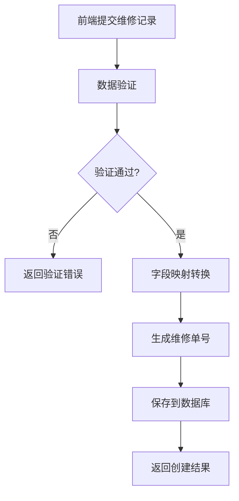

# 维修记录功能设计草案

## 项目概述

基于前端完整实现的维修记录功能设计草案，确保前后端数据结构和业务逻辑的一致性。

**设计原则**: 以前端实现为标准，后端适配前端需求

**创建时间**: 2024-12-19  
**版本**: v1.0  
**状态**: 草案

---

## 1. 数据模型设计

### 1.1 前端数据结构（标准）

基于 `web/src/views/device-maintenance/repair-records/index.vue.backup2` 中的 `initForm` 定义：

```javascript
// 前端完整字段结构（23个字段）
const repairRecordForm = {
  // 基础标识信息
  serial_number: "",           // 维修记录序列号
  repair_date: "",            // 报修日期
  category: "",               // 维修类别
  
  // 设备基础信息
  device_number: "",          // 设备编号
  brand: "",                  // 品牌
  model: "",                  // 型号
  device_name: "",            // 设备名称
  manufacturer: "",           // 制造商
  installation_location: "",   // 安装位置
  application_department: "", // 使用部门
  
  // 申请人信息
  company: "",                // 公司
  applicant: "",              // 申请人
  
  // 故障信息
  fault_reason: "",           // 故障原因
  fault_content: "",          // 故障内容
  
  // 维修信息
  repair_person: "",          // 维修人员
  repair_completion_date: "", // 维修完成日期
  repair_cost: 0,             // 维修费用
  spare_parts_used: "",       // 使用备件
  repair_notes: "",           // 维修备注
  
  // 维护类型和状态
  maintenance_type: "",       // 维护类型
  downtime_hours: 0,          // 停机时间（小时）
  warranty_status: "",        // 保修状态
  status: ""                  // 维修状态
}
```

### 1.2 后端数据模型适配

#### 1.2.1 核心模型结构

```python
class DeviceRepairRecordCreate(BaseModel):
    """创建设备维修记录模型 - 适配前端完整字段"""
    
    # 必需字段（后端业务需要）
    device_id: int = Field(..., description="设备ID")
    device_type: str = Field(..., description="设备类型")
    
    # 基础信息（映射前端字段）
    repair_date: date = Field(..., description="报修日期")
    repair_status: str = Field("pending", description="维修状态")
    priority: str = Field("medium", description="优先级")
    
    # 申请人信息（映射前端字段）
    applicant: str = Field(..., description="申请人")
    applicant_dept: Optional[str] = Field(None, description="申请部门")
    company: Optional[str] = Field(None, description="公司")
    
    # 故障信息（映射前端字段）
    fault_reason: Optional[str] = Field(None, description="故障原因")
    fault_content: Optional[str] = Field(None, description="故障内容")
    damage_category: Optional[str] = Field(None, description="损坏类别")
    
    # 维修信息（映射前端字段）
    repair_content: Optional[str] = Field(None, description="维修内容")
    repairer: Optional[str] = Field(None, description="维修人员")
    repair_completion_date: Optional[date] = Field(None, description="维修完成日期")
    repair_cost: Optional[float] = Field(None, description="维修成本")
    spare_parts_used: Optional[str] = Field(None, description="使用备件")
    
    # 前端特有字段存储
    frontend_specific_data: Optional[Dict[str, Any]] = Field(None, description="前端特有字段数据")
    
    # 附加信息
    remarks: Optional[str] = Field(None, description="备注")
```

#### 1.2.2 字段映射关系

| 前端字段 | 后端字段 | 映射方式 | 说明 |
|---------|---------|---------|------|
| `serial_number` | `frontend_specific_data.serial_number` | 存储到扩展字段 | 前端生成的序列号 |
| `repair_date` | `repair_date` | 直接映射 | 报修日期 |
| `category` | `damage_category` | 直接映射 | 维修类别 |
| `device_number` | `frontend_specific_data.device_number` | 存储到扩展字段 | 设备编号 |
| `brand` | `frontend_specific_data.brand` | 存储到扩展字段 | 品牌信息 |
| `model` | `frontend_specific_data.model` | 存储到扩展字段 | 型号信息 |
| `device_name` | `frontend_specific_data.device_name` | 存储到扩展字段 | 设备名称 |
| `manufacturer` | `frontend_specific_data.manufacturer` | 存储到扩展字段 | 制造商 |
| `installation_location` | `frontend_specific_data.installation_location` | 存储到扩展字段 | 安装位置 |
| `application_department` | `applicant_dept` | 直接映射 | 使用部门 |
| `company` | `company` | 直接映射 | 公司信息 |
| `applicant` | `applicant` | 直接映射 | 申请人 |
| `fault_reason` | `fault_reason` | 直接映射 | 故障原因 |
| `fault_content` | `fault_content` | 直接映射 | 故障内容 |
| `repair_person` | `repairer` | 直接映射 | 维修人员 |
| `repair_completion_date` | `repair_completion_date` | 直接映射 | 维修完成日期 |
| `repair_cost` | `repair_cost` | 直接映射 | 维修费用 |
| `spare_parts_used` | `spare_parts_used` | 直接映射 | 使用备件 |
| `repair_notes` | `remarks` | 直接映射 | 维修备注 |
| `maintenance_type` | `frontend_specific_data.maintenance_type` | 存储到扩展字段 | 维护类型 |
| `downtime_hours` | `frontend_specific_data.downtime_hours` | 存储到扩展字段 | 停机时间 |
| `warranty_status` | `frontend_specific_data.warranty_status` | 存储到扩展字段 | 保修状态 |
| `status` | `repair_status` | 状态映射 | 维修状态（需要状态转换） |

#### 1.2.3 状态映射规则

```python
# 前端状态 -> 后端状态映射
STATUS_MAPPING = {
    "待处理": "pending",
    "进行中": "in_progress", 
    "已完成": "completed",
    "已取消": "cancelled"
}

# 后端状态 -> 前端状态映射
REVERSE_STATUS_MAPPING = {
    "pending": "待处理",
    "in_progress": "进行中",
    "completed": "已完成", 
    "cancelled": "已取消"
}
```

---

## 2. API接口设计

### 2.1 创建维修记录接口

**接口路径**: `POST /api/v2/device/maintenance/repair-records`

**请求体结构**:
```json
{
  "device_id": 1,
  "device_type": "焊接设备",
  "repair_date": "2024-12-19",
  "applicant": "张三",
  "applicant_dept": "生产部",
  "company": "测试公司",
  "fault_reason": "设备老化",
  "fault_content": "设备出现异常噪音",
  "repairer": "李四",
  "repair_completion_date": "2024-12-22",
  "repair_cost": 1500.50,
  "spare_parts_used": "轴承、密封圈",
  "remarks": "更换老化部件",
  "frontend_specific_data": {
    "serial_number": "RR20241219001",
    "device_number": "DEV001",
    "brand": "华为",
    "model": "WLD-2000",
    "device_name": "焊接设备01",
    "manufacturer": "华为技术",
    "installation_location": "车间A-01",
    "maintenance_type": "故障维修",
    "downtime_hours": 8.5,
    "warranty_status": "保修期内"
  }
}
```

**响应体结构**:
```json
{
  "code": 200,
  "message": "维修记录创建成功",
  "data": {
    "id": 1,
    "device_id": 1,
    "repair_code": "WX20241219001",
    "repair_date": "2024-12-19",
    "repair_status": "pending",
    "applicant": "张三",
    "fault_content": "设备出现异常噪音",
    "repairer": "李四",
    "repair_cost": 1500.50,
    "frontend_specific_data": {
      "serial_number": "RR20241219001",
      "device_number": "DEV001",
      "brand": "华为",
      "model": "WLD-2000"
    },
    "created_at": "2024-12-19T10:30:00Z",
    "updated_at": "2024-12-19T10:30:00Z"
  }
}
```

### 2.2 查询维修记录接口

**接口路径**: `GET /api/v2/device/maintenance/repair-records`

**查询参数**:
- `page`: 页码（默认1）
- `page_size`: 每页数量（默认20）
- `device_id`: 设备ID筛选
- `repair_status`: 维修状态筛选
- `start_date`: 开始日期
- `end_date`: 结束日期
- `applicant`: 申请人筛选

### 2.3 更新维修记录接口

**接口路径**: `PUT /api/v2/device/maintenance/repair-records/{record_id}`

### 2.4 删除维修记录接口

**接口路径**: `DELETE /api/v2/device/maintenance/repair-records/{record_id}`

---

## 3. 数据库设计

### 3.1 主表结构

```sql
CREATE TABLE device_repair_records (
    id SERIAL PRIMARY KEY,
    device_id INTEGER NOT NULL REFERENCES devices(id),
    device_type VARCHAR(100) NOT NULL,
    
    -- 基础信息
    repair_date DATE NOT NULL,
    repair_code VARCHAR(50) UNIQUE,
    repair_status VARCHAR(20) DEFAULT 'pending',
    priority VARCHAR(20) DEFAULT 'medium',
    
    -- 申请人信息
    applicant VARCHAR(100) NOT NULL,
    applicant_phone VARCHAR(20),
    applicant_dept VARCHAR(100),
    company VARCHAR(200),
    
    -- 故障信息
    is_fault BOOLEAN DEFAULT TRUE,
    fault_reason TEXT,
    damage_category VARCHAR(100),
    fault_content TEXT,
    fault_location VARCHAR(200),
    
    -- 维修信息
    repair_content TEXT,
    spare_parts_used TEXT,
    repairer VARCHAR(100),
    repair_start_time TIMESTAMP,
    repair_completion_date DATE,
    repair_cost DECIMAL(10,2),
    
    -- 前端特有字段（JSON存储）
    frontend_specific_data JSONB,
    
    -- 附加信息
    remarks TEXT,
    attachments JSONB,
    
    -- 审计字段
    created_by INTEGER,
    updated_by INTEGER,
    created_at TIMESTAMP DEFAULT CURRENT_TIMESTAMP,
    updated_at TIMESTAMP DEFAULT CURRENT_TIMESTAMP
);
```

### 3.2 索引设计

```sql
-- 基础查询索引
CREATE INDEX idx_repair_records_device_id ON device_repair_records(device_id);
CREATE INDEX idx_repair_records_status ON device_repair_records(repair_status);
CREATE INDEX idx_repair_records_date ON device_repair_records(repair_date);
CREATE INDEX idx_repair_records_applicant ON device_repair_records(applicant);

-- 复合索引
CREATE INDEX idx_repair_records_device_status ON device_repair_records(device_id, repair_status);
CREATE INDEX idx_repair_records_date_status ON device_repair_records(repair_date, repair_status);

-- JSON字段索引（PostgreSQL）
CREATE INDEX idx_repair_records_frontend_data ON device_repair_records USING GIN (frontend_specific_data);
```

---

## 4. 业务逻辑设计

### 4.1 创建维修记录流程



### 4.2 字段映射转换逻辑

```python
def map_frontend_to_backend(frontend_data: Dict[str, Any]) -> Dict[str, Any]:
    """
    将前端数据映射为后端数据格式
    """
    # 提取直接映射字段
    backend_data = {
        "repair_date": frontend_data.get("repair_date"),
        "applicant": frontend_data.get("applicant"),
        "applicant_dept": frontend_data.get("application_department"),
        "company": frontend_data.get("company"),
        "fault_reason": frontend_data.get("fault_reason"),
        "fault_content": frontend_data.get("fault_content"),
        "repairer": frontend_data.get("repair_person"),
        "repair_completion_date": frontend_data.get("repair_completion_date"),
        "repair_cost": frontend_data.get("repair_cost"),
        "spare_parts_used": frontend_data.get("spare_parts_used"),
        "remarks": frontend_data.get("repair_notes"),
        "damage_category": frontend_data.get("category"),
        "repair_status": map_status_to_backend(frontend_data.get("status"))
    }
    
    # 提取前端特有字段
    frontend_specific_data = {
        "serial_number": frontend_data.get("serial_number"),
        "device_number": frontend_data.get("device_number"),
        "brand": frontend_data.get("brand"),
        "model": frontend_data.get("model"),
        "device_name": frontend_data.get("device_name"),
        "manufacturer": frontend_data.get("manufacturer"),
        "installation_location": frontend_data.get("installation_location"),
        "maintenance_type": frontend_data.get("maintenance_type"),
        "downtime_hours": frontend_data.get("downtime_hours"),
        "warranty_status": frontend_data.get("warranty_status")
    }
    
    backend_data["frontend_specific_data"] = frontend_specific_data
    return backend_data
```

### 4.3 数据验证规则

#### 4.3.1 必填字段验证
- `device_id`: 必须为正整数
- `applicant`: 必须非空，长度2-50字符
- `repair_date`: 必须为有效日期格式

#### 4.3.2 业务逻辑验证
- `repair_completion_date` 不能早于 `repair_date`
- `repair_cost` 必须为非负数
- `downtime_hours` 必须为非负数

#### 4.3.3 数据格式验证
- 日期字段必须符合 ISO 8601 格式
- 状态字段必须在预定义范围内
- JSON字段必须为有效JSON格式

---

## 5. 前端适配要求

### 5.1 表单验证规则

```javascript
const validationRules = {
  applicant: [
    { required: true, message: '请输入申请人', trigger: 'blur' },
    { min: 2, max: 50, message: '申请人长度在2到50个字符', trigger: 'blur' }
  ],
  repair_date: [
    { required: true, message: '请选择报修日期', trigger: 'change' }
  ],
  fault_content: [
    { required: true, message: '请输入故障内容', trigger: 'blur' },
    { min: 10, max: 500, message: '故障内容长度在10到500个字符', trigger: 'blur' }
  ],
  repair_cost: [
    { type: 'number', min: 0, message: '维修费用不能为负数', trigger: 'blur' }
  ],
  downtime_hours: [
    { type: 'number', min: 0, message: '停机时间不能为负数', trigger: 'blur' }
  ]
}
```

### 5.2 状态显示映射

```javascript
const statusDisplayMap = {
  'pending': { text: '待处理', color: 'orange' },
  'in_progress': { text: '进行中', color: 'blue' },
  'completed': { text: '已完成', color: 'green' },
  'cancelled': { text: '已取消', color: 'red' }
}
```

---

## 6. 测试策略

### 6.1 单元测试

- **字段映射测试**: 验证前后端字段映射的正确性
- **数据验证测试**: 验证各种数据验证规则
- **状态转换测试**: 验证状态映射的准确性

### 6.2 集成测试

- **API接口测试**: 验证所有CRUD操作
- **数据完整性测试**: 验证数据存储和检索的完整性
- **业务流程测试**: 验证完整的维修记录业务流程

### 6.3 前后端联调测试

- **数据格式兼容性测试**: 验证前后端数据格式的兼容性
- **用户界面测试**: 验证前端界面的功能完整性
- **性能测试**: 验证系统在负载下的性能表现

---

## 7. 实施计划

### 7.1 第一阶段：后端适配（1-2天）

1. **更新数据模型**
   - 修改 `DeviceRepairRecordCreate` 模型
   - 添加 `frontend_specific_data` 字段
   - 更新字段映射逻辑

2. **完善API接口**
   - 实现字段映射转换函数
   - 更新数据验证规则
   - 完善错误处理逻辑

3. **数据库迁移**
   - 添加 `frontend_specific_data` JSONB字段
   - 创建必要的索引
   - 数据迁移脚本

### 7.2 第二阶段：测试验证（1天）

1. **创建综合测试**
   - 基于前端23个字段的完整测试
   - 字段映射验证测试
   - 业务逻辑测试

2. **执行测试验证**
   - 运行所有测试用例
   - 修复发现的问题
   - 性能测试

### 7.3 第三阶段：前端调整（0.5天）

1. **API调用适配**
   - 确保前端调用正确的API端点
   - 验证数据格式兼容性
   - 错误处理优化

2. **用户界面优化**
   - 状态显示优化
   - 表单验证完善
   - 用户体验改进

---

## 8. 风险评估与应对

### 8.1 技术风险

| 风险项 | 风险等级 | 影响 | 应对措施 |
|-------|---------|------|---------|
| 字段映射复杂性 | 中 | 数据丢失或错误 | 详细测试，逐步迁移 |
| 数据库性能 | 低 | 查询性能下降 | 合理设计索引 |
| 前后端兼容性 | 中 | 功能异常 | 充分的集成测试 |

### 8.2 业务风险

| 风险项 | 风险等级 | 影响 | 应对措施 |
|-------|---------|------|---------|
| 数据迁移 | 中 | 历史数据丢失 | 备份策略，分步迁移 |
| 用户体验 | 低 | 用户操作困惑 | 用户培训，文档更新 |

---

## 9. 验收标准

### 9.1 功能验收

- [ ] 前端23个字段全部支持
- [ ] 所有CRUD操作正常
- [ ] 数据验证规则生效
- [ ] 状态转换正确

### 9.2 性能验收

- [ ] 创建维修记录响应时间 < 2秒
- [ ] 查询维修记录响应时间 < 1秒
- [ ] 支持并发用户数 >= 50

### 9.3 质量验收

- [ ] 单元测试覆盖率 >= 80%
- [ ] 集成测试通过率 = 100%
- [ ] 代码质量检查通过

---

## 10. 后续优化方向

### 10.1 功能扩展

- 维修记录审批流程
- 维修记录统计分析
- 维修记录导出功能
- 移动端支持

### 10.2 技术优化

- 缓存策略优化
- 数据库查询优化
- 前端性能优化
- 监控告警完善

---

**文档状态**: 草案  
**下一步**: 基于此设计草案创建详细的测试文件  
**负责人**: 开发团队  
**审核人**: 技术负责人